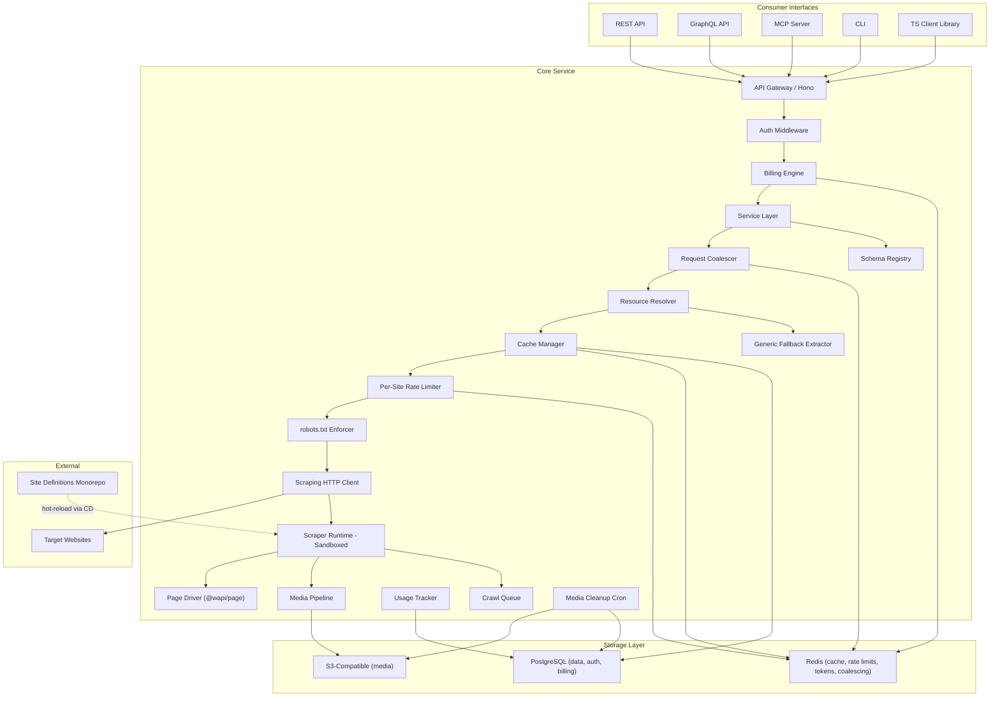
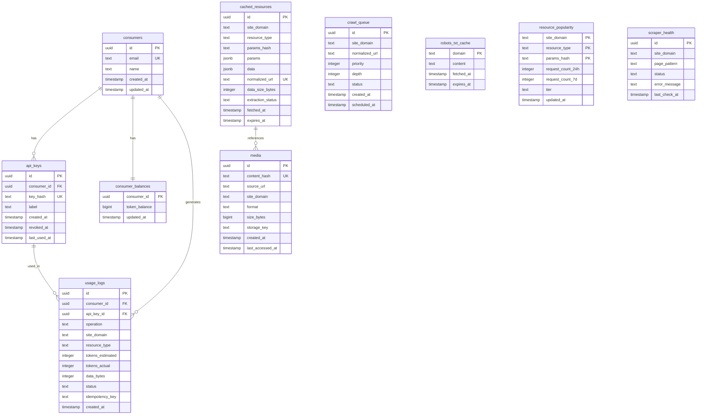
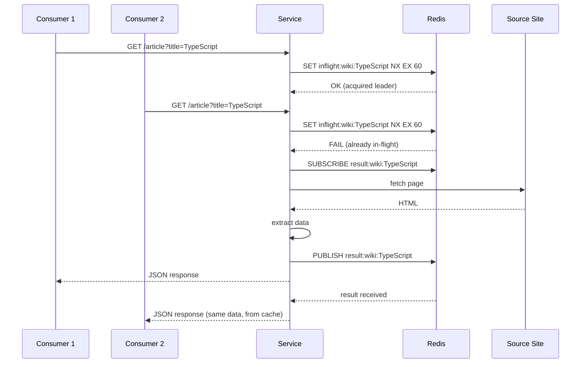
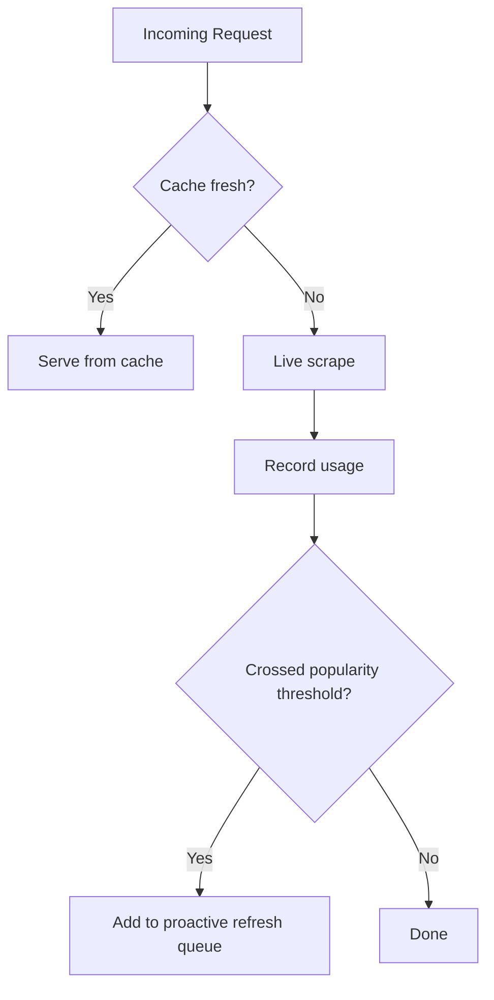
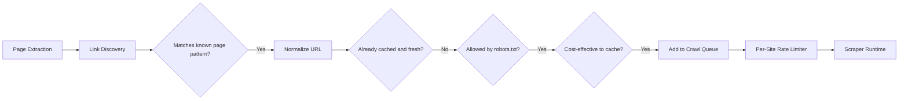
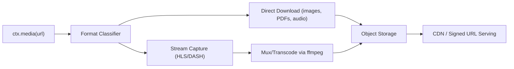

# WAPI - Web API Service Architecture

## 1. Glossary of Actors

- **Operator** - The entity (you) running the WAPI platform. Manages infrastructure, billing, scraper curation, and platform health.
- **Scraper Author** - A developer who writes and maintains *site definitions* -- the declarative TS modules that describe how to extract data from a specific website. Contributes via PRs to the monorepo.
- **Consumer** - A developer or application that queries the WAPI service to retrieve structured data or media. Interfaces via REST API, GraphQL, TypeScript client, MCP server, or CLI.
- **Site** (Source) - A target website from which data is extracted (e.g. wikipedia.org, news.ycombinator.com).
- **Page** - A specific URL pattern on a site from which data can be extracted (e.g. `/wiki/:title` on Wikipedia). Each page declares a `validate` function to detect blocking/rate-limiting, an `extract` function to pull data, and optionally a `paginate` descriptor.
- **Resource** - A typed data object extracted from a page that conforms to a schema (e.g. an Article from Wikipedia). The primary unit of data the service provides.
- **Schema** - A structural type definition (e.g. "Product", "Article", "Person") describing the shape of a resource. Based on schema.org vocabulary, enabling cross-site interoperability.
- **Site Definition** - The complete declarative specification authored by a scraper author, covering a site's resources, pages, URL patterns, URL normalization, extraction logic, validation, pagination, link discovery, crawl policy, and schema mappings.
- **Token** - The billing unit. Operations consume tokens proportional to their actual cost (per-MB of data/media transferred + a base compute cost per operation). Tokens are deducted immediately before work begins and are never refunded due to consumer disconnect.
- **Page Driver** - An abstraction over DOM query engines (Cheerio, JSDOM, and future Playwright). Provides a uniform read interface to scraper authors regardless of the underlying engine. Defined in `@wapi/page`.
- **Generic Fallback Extractor** - A built-in extractor that handles URLs with no site definition by pulling JSON-LD, OpenGraph, meta tags, and microdata from any page.

---

## 2. User Stories

### Consumer Stories

- As a consumer, I want to **submit a URL and get structured JSON back**, so I don't have to write my own scraper -- even if no site definition exists (via the generic fallback).
- As a consumer, I want to **browse available sites** and see what resources each one provides, so I can discover what data is available.
- As a consumer, I want to **fetch a resource by type and parameters** (e.g. `Article { title: "TypeScript" }` on Wikipedia) without knowing the URL structure.
- As a consumer, I want to **search across all sites for a schema type** (e.g. "which sites provide Article resources?"), so I can find the best source for my needs.
- As a consumer, I want to **control pagination** -- request a specific number of pages, continue from where I left off via cursor, or fetch all pages -- and understand the cost upfront.
- As a consumer, I want to **download and receive hosted media** (images, videos, streams) from a page, so I can use them in my application.
- As a consumer, I want a **type-safe TypeScript client** with autocomplete for each site's resources, so I catch errors at compile time -- without needing a code generation step.
- As a consumer, I want to **use a CLI** to quickly test queries and inspect available data.
- As a consumer, I want to **use WAPI via MCP** so my AI assistant/agent can access web data.
- As a consumer, I want to **query via GraphQL** to fetch nested resources across sites in a single request.
- As a consumer, I want **predictable token-based pricing** proportional to actual costs (data size, compute) and a dashboard showing my usage and remaining balance.
- As a consumer, I want to **request fresh data** when I need it (at a higher token cost), or accept cached data for cheaper queries.
- As a consumer, I want to **understand why an extraction failed** -- whether the site blocked the request or the scraper is outdated -- so I can report it or wait for a fix.

### Scraper Author Stories

- As a scraper author, I want a **clear, well-documented framework** with TypeScript types for defining site scrapers.
- As a scraper author, I want to **test my scraper locally** against live sites or HTML fixtures before submitting.
- As a scraper author, I want **built-in utilities** for common tasks: JSON-LD parsing, CSS selection, pagination, date parsing, URL construction.
- As a scraper author, I want to **declare what schema(s) my resources conform to**, so consumers can work with standard types.
- As a scraper author, I want to **define URL routing** so the platform can resolve resource parameters to URLs.
- As a scraper author, I want to **write a `validate` function** for each page so the platform can distinguish rate-limiting/blocking from stale scrapers.
- As a scraper author, I want to **define URL normalization** so duplicate URLs resolve to the same canonical form.
- As a scraper author, I want to **define pagination** using a simple `next` function, and let the framework handle the rest.
- As a scraper author, I want to **contribute via pull requests** with automated CI validation (linting, type-checking, fixture tests, live canary tests, schema validation, robots.txt compliance).
- As a scraper author, I want to **extend standard schemas** with site-specific fields when a site provides data beyond the standard.
- As a scraper author, I want a **DOM abstraction** that works the same whether the page is static (Cheerio) or dynamic (Playwright in the future), so my scraper doesn't need rewriting later.

### Operator Stories

- As the operator, I want to **monitor scraper health** and detect when site changes break extractors, distinguishing between site-blocked and scraper-outdated failures.
- As the operator, I want to **manage caching policies** to balance freshness against infrastructure cost.
- As the operator, I want to **track per-consumer usage** for billing and rate limiting.
- As the operator, I want to **review and approve community contributions** before they go live.
- As the operator, I want **observability** (logs, metrics, alerts) across the scraping pipeline.
- As the operator, I want the system to be **horizontally scalable** so I can add capacity as demand grows.
- As the operator, I want **background crawling** to proactively fill the cache for popular and cost-effective resources.
- As the operator, I want **automatic media cleanup** to prevent runaway storage costs.
- As the operator, I want to **hot-reload site definitions** via CD without restarting the service.

---

## 3. Architecture Overview




### Shared Service Layer

The architecture uses a **service layer** pattern. REST routes, GraphQL resolvers, MCP tool handlers, and the CLI all call into the same service layer. This avoids duplicating logic across API surfaces.

```
REST route handlers  ──┐
GraphQL resolvers    ──┼──> Service Layer ──> Resolver, Cache, Billing, Runtime
MCP tool handlers    ──┤
CLI commands         ──┘
```

### Key Data Flow

1. Consumer sends a request (URL, or resource type + params, or discovery query)
2. **Auth Middleware** validates the API key (SHA-256 hash lookup against `api_keys` table)
3. **Billing Engine** estimates cost and **immediately deducts tokens** via atomic Redis `DECRBY`. If balance insufficient, reject with `402`
4. **Service Layer** delegates to **Request Coalescer** -- if an identical request is already in-flight, this request waits for that result instead of duplicating work
5. **Resource Resolver** identifies the site definition and page handler; if no definition exists, delegates to the **Generic Fallback Extractor**
6. **Cache Manager** checks if fresh-enough data exists; if so, returns it (cheap -- reconciles token estimate down)
7. If not cached, the request enters the **Per-Site Rate Limiter** queue (shared across all consumers and crawl jobs)
8. **robots.txt Enforcer** checks the path against the cached robots.txt for the site. If disallowed, reject with a `forbidden_by_robots` status
9. **Scraping HTTP Client** fetches the page with realistic headers, compression, redirect handling
10. **Scraper Runtime** executes the extractor in a sandboxed V8 isolate using the **Page Driver**
11. The `**validate**` function runs first -- if it fails, classified as **blocked**
12. If extraction succeeds, data is cached and links are pushed to the **Crawl Queue**; if extraction throws after validation passed, classified as **stale**
13. If media is referenced, **Media Pipeline** handles download/storage
14. **Billing Engine** reconciles: adjusts token balance based on actual data size. **Tokens are never refunded due to consumer disconnect** -- the work completes regardless to populate the cache
15. Response is returned with extraction status (`success`, `blocked`, `stale`, `forbidden_by_robots`, `error`)

---

## 4. Entity Relationship Diagram




### Key Design Decisions

- `**api_keys.key_hash**` stores the SHA-256 hash of the API key, never the plaintext. The consumer receives the plaintext exactly once at creation time.
- `**consumer_balances**` is a separate table (not a column on `consumers`) to allow tight row-level locking during balance updates without contending on the consumer row.
- `**cached_resources.params_hash**` is a deterministic hash of the sorted params JSON, used for fast lookups. The full `params` JSONB is stored alongside for debugging and display.
- `**cached_resources.normalized_url**` is unique -- URL normalization ensures only one cache entry per canonical URL.
- `**usage_logs.idempotency_key**` prevents double-charging on consumer retries (see Section 13).
- `**resource_popularity**` tracks request frequency per resource for cache tiering decisions. Counters are maintained in Redis and flushed to Postgres periodically.
- `**robots_txt_cache**` stores fetched robots.txt content with a 24h TTL to avoid re-fetching on every request.

---

## 5. Extraction Failure Classification

Every extraction returns a status alongside the data (or lack thereof):

- `**success**` -- Page validated, data extracted correctly.
- `**blocked**` -- The `validate` function failed. The page received does not look like the real page (likely rate-limiting, CAPTCHA, geo-block, or bot detection). The consumer is still charged base compute (the request was made, bandwidth was consumed).
- `**stale**` -- The `validate` function passed (we got the real page) but extraction threw an error or returned data missing required schema fields. This means the site's DOM structure has changed and the scraper needs updating. An alert is raised to the operator. The consumer is still charged base compute.
- `**forbidden_by_robots**` -- The requested path is disallowed by the site's robots.txt. No outbound request is made. The consumer is not charged.
- `**error**` -- Network failure, DNS error, timeout, or system error. The consumer is charged base compute (the system performed work attempting the request).

### Billing on All Outcomes

Tokens are deducted for all outcomes except `forbidden_by_robots` and free discovery queries. The rationale: every non-trivial request consumes compute, bandwidth, or both. If the system allowed free retries on errors, a malicious actor could DDoS source sites at no cost by flooding requests that trigger errors. The upfront estimate is deducted, and reconciliation adjusts based on actual data transferred -- but the base compute cost is always charged.

### How `validate` Works

Each page in a site definition includes a `validate` function that asserts invariants about the real page -- things that would be true regardless of content changes but would be false on a block/captcha page:

```typescript
'/wiki/:title': {
  validate: (ctx) => {
    // These are true on any real Wikipedia article, but false on a block page
    return ctx.$('#content').exists()
        && ctx.$('.mw-parser-output').exists()
        && ctx.status === 200
  },
  extract: async (ctx) => { ... }
}
```

The framework enforces that `validate` is defined for every page. CI will fail if it is missing.

---

## 6. URL Normalization

### Problem

The same resource can often be reached via many URLs: tracking parameters, www vs non-www, trailing slashes, locale prefixes, etc. Without normalization, the cache stores duplicates and consumers see inconsistent data.

### Solution

Each site definition provides a `normalizeUrl` function that maps any matched URL to its canonical form:

```typescript
export default defineSite({
  domain: "en.wikipedia.org",
  normalizeUrl: (url) => {
    const u = new URL(url);
    u.searchParams.delete("action");
    u.searchParams.delete("oldid");
    u.hash = "";
    return u.toString();
  },
  // ...
});
```

### Framework Invariants

The framework enforces that URL normalization is consistent with resource resolution:

```
normalizeUrl(baseUrl + resource.resolve(params)) === normalizeUrl(anyMatchingUrl)
```

This invariant is **checked in CI** for every example URL defined on each page. If a resolved URL normalizes to something different than an example URL for the same resource, the test fails. This prevents cache misses caused by normalization/resolution misalignment.

### Canonical URL Exposure

The framework also exposes the page's `<link rel="canonical">` to extractors via `ctx.canonical`, which authors can use in their normalization logic or data output.

---

## 7. Scraper Definition Framework

This is the heart of the system. Each site is defined as a TypeScript module using a `defineSite()` builder function.

### Site Definition Structure

```typescript
// sites/en.wikipedia.org/index.ts
import { defineSite, Schema } from "@wapi/framework";

export default defineSite({
  name: "Wikipedia (English)",
  domain: "en.wikipedia.org",
  aliases: ["www.wikipedia.org"],

  normalizeUrl: (url) => {
    const u = new URL(url);
    u.searchParams.delete("action");
    u.searchParams.delete("oldid");
    u.hash = "";
    return u.toString();
  },

  // Per-site rate limit (governs ALL outbound requests: consumer, crawl, ctx.fetch)
  rateLimit: {
    maxConcurrent: 3,
    requestsPerSecond: 1,
  },

  resources: {
    article: {
      schema: Schema.Article,
      params: {
        title: {
          type: "string",
          required: true,
          description: "Article title (URL-encoded)",
        },
      },
      resolve: ({ title }) => `/wiki/${encodeURIComponent(title)}`,
      ttl: "24h",
    },
  },

  pages: {
    "/wiki/:title": {
      provides: ["article"],
      examples: ["https://en.wikipedia.org/wiki/TypeScript"],

      validate: (ctx) => {
        return (
          ctx.$("#content").exists() &&
          ctx.$(".mw-parser-output").exists() &&
          ctx.status === 200
        );
      },

      extract: async (ctx) => {
        const ld = ctx.jsonLd(Schema.Article);
        return {
          article: {
            title: ctx.$("#firstHeading").text().trim(),
            summary: ctx.$(".mw-parser-output > p").first().text().trim(),
            image: ctx.media(ctx.$(".infobox img").first().attr("src")),
            categories: ctx
              .$$("#mw-normal-catlinks li a")
              .map((el) => el.text()),
            lastModified: ctx.$("#footer-info-lastmod").text(),
            ...ld,
          },
        };
      },
    },
  },

  crawl: {
    enabled: true,
    respectRobotsTxt: true,
    maxDepth: 2,
    filterLinks: (url) => !url.includes("/Special:"),
  },
} as const);
```

### Hacker News Example (with Pagination)

```typescript
// sites/news.ycombinator.com/index.ts
import { defineSite, Schema } from "@wapi/framework";

export default defineSite({
  name: "Hacker News",
  domain: "news.ycombinator.com",

  normalizeUrl: (url) => {
    const u = new URL(url);
    // Keep only meaningful params
    const id = u.searchParams.get("id");
    const p = u.searchParams.get("p");
    u.search = "";
    if (id) u.searchParams.set("id", id);
    if (p) u.searchParams.set("p", p);
    return u.toString();
  },

  rateLimit: {
    maxConcurrent: 2,
    requestsPerSecond: 0.5,
  },

  resources: {
    story: {
      schema: Schema.Article,
      params: {
        id: { type: "string", required: true, description: "HN story ID" },
      },
      resolve: ({ id }) => `/item?id=${id}`,
      ttl: "1h",
    },
    frontPage: {
      schema: Schema.ItemList,
      params: {},
      resolve: () => "/news",
      ttl: "5m",
    },
  },

  pages: {
    "/news": {
      provides: ["frontPage"],
      examples: ["https://news.ycombinator.com/news"],

      validate: (ctx) => {
        return ctx.$(".itemlist").exists() && ctx.status === 200;
      },

      // Pagination: HN front page has "More" link at the bottom
      paginate: {
        next: (ctx) => {
          const more = ctx.$("a.morelink")?.attr("href");
          return more ? `https://news.ycombinator.com/${more}` : null;
        },
      },

      extract: async (ctx) => ({
        frontPage: ctx.$$(".athing").map((el) => ({
          id: el.attr("id"),
          title: el.$(".titleline > a").text(),
          url: el.$(".titleline > a").attr("href"),
          score: parseInt(el.next().$(".score")?.text() ?? "0"),
        })),
      }),
    },

    "/item": {
      provides: ["story"],
      examples: ["https://news.ycombinator.com/item?id=1"],

      validate: (ctx) => {
        return ctx.$(".fatitem").exists() && ctx.status === 200;
      },

      extract: async (ctx) => ({
        story: {
          id: ctx.params.id,
          title: ctx.$(".titleline > a").text(),
          url: ctx.$(".titleline > a").attr("href"),
          author: ctx.$(".hnuser").text(),
          score: parseInt(ctx.$(".score")?.text() ?? "0"),
          comments: ctx.$$(".comtr").map((el) => ({
            id: el.attr("id"),
            author: el.$(".hnuser").text(),
            text: el.$(".commtext").text(),
          })),
        },
      }),
    },
  },

  crawl: {
    enabled: true,
    respectRobotsTxt: true,
    maxDepth: 1,
  },
} as const);
```

### Framework Utilities (`@wapi/framework`)

The framework package provides:

- `**defineSite()**` -- type-safe builder for site definitions with `as const` support for full type inference
- `**ctx.$(selector)**` -- query a single element (returns a `PageElement` from `@wapi/page`)
- `**ctx.$$(selector)**` -- query all matching elements (returns `PageElement[]`)
- `**ctx.jsonLd(schemaType?)**` -- auto-parsed JSON-LD from the page, optionally filtered by `@type`
- `**ctx.media(url)**` -- marks a URL as media for the media pipeline; returns a `MediaRef`. Records the URL immediately for later processing by the pipeline after extraction completes. The extractor continues synchronously.
- `**ctx.params**` -- URL pattern params (`:title` etc.)
- `**ctx.url**` -- the full resolved URL
- `**ctx.canonical**` -- the `<link rel="canonical">` href from the page, if present
- `**ctx.status**` -- the HTTP status code of the fetched page
- `**ctx.headers**` -- response headers
- `**ctx.fetch(url, opts?)**` -- sandboxed HTTP fetch for supplementary requests (see below)
- `**ctx.paginate(nextSelector, extractFn)**` -- pagination helper
- **Date/price/currency parsing utilities**
- **Test harness** for running extractors against HTML fixture files

### `ctx.fetch()` in Detail

`ctx.fetch()` is for making supplementary HTTP requests during extraction. Many modern websites load data via XHR/fetch calls that the static HTML doesn't contain (e.g. price data loaded from an internal API). The extractor needs to replicate these calls.

**Behavior:**

- **Not deferred** -- executes immediately and returns a `Promise<Response>`, just like the standard `fetch` API
- **Domain-restricted** -- only allowed to fetch from the site's `domain` and `aliases` by default. The site definition can declare additional allowed domains via an `allowedFetchDomains` array.
- **Rate-limited** -- goes through the same per-site rate limiter as the initial page fetch (see Section 11)
- **Counted** -- each `ctx.fetch()` call adds to the request's token cost (compute + per-MB of response)
- **robots.txt enforced** -- the path is checked against robots.txt before the request is made
- **Sandboxed** -- runs through the framework's scraping HTTP client, not a raw `fetch`. Headers like cookies/auth are managed by the framework.

```typescript
extract: async (ctx) => {
  // Fetch supplementary data from an internal API
  const priceData = await ctx.fetch(`/api/prices?id=${ctx.params.asin}`);
  const prices = await priceData.json();
  return {
    product: {
      name: ctx.$("h1").text(),
      price: prices.currentPrice,
    },
  };
};
```

### Sandboxing

Since site definitions are community-contributed code, they run in a sandbox:

- Use **V8 isolates** (via the `isolated-vm` npm package) for strong isolation
- The `ctx` object is the only interface to the outside world -- no direct `fs`, `net`, or `process` access
- `ctx.fetch()` is domain-restricted and robots.txt-enforced as described above
- Memory and CPU time limits enforced per execution
- Later, for dynamic sites requiring browser interaction, the sandbox extends to a headless browser instance with similar restrictions

---

## 8. Pagination

### The Problem

Many resources span multiple pages: HN front page across 10+ pages, Wikipedia category members, product review lists. Pagination involves two independent concerns:

1. **The scraper author** defines the *mechanics* of pagination (how to find the next page)
2. **The consumer** controls *how much* data to retrieve (and pay for)

### Scraper Author Interface

Each page can optionally declare a `paginate` descriptor:

```typescript
paginate: {
  // Returns the absolute URL of the next page, or null if there are no more pages.
  // This is the only required field. It works regardless of pagination style
  // (link-based, param-based, cursor-based) because the author resolves it to a URL.
  next: (ctx) => {
    const href = ctx.$('a.morelink')?.attr('href')
    return href ? new URL(href, ctx.url).toString() : null
  },

  // Optional: extract total counts for response metadata.
  // These help the consumer understand the scope of the data.
  totalItems?: (ctx) => parseInt(ctx.$('.result-count').text()),
  totalPages?: (ctx) => parseInt(ctx.$('.page-count').text()),
}
```

The `next` function is universal. Whether the site uses "next page" links, `?page=N` parameters, or cursors, the author resolves it to a concrete URL. The framework handles fetching subsequent pages, running `validate` and `extract` on each one, and concatenating results.

### Consumer Request Interface

Consumers control pagination via query parameters:

- **Default (no param)** -- returns the first page only. Safe, cheap, predictable.
- `**?maxPages=N**` -- fetch up to N pages sequentially. Each page is a separate scrape and costs tokens independently.
- `**?cursor=<opaque>**` -- resume from where a previous request left off. The cursor is an opaque token (base64-encoded next-page URL) returned in the previous response's pagination metadata.

There is no `?allPages=true`. Unbounded pagination is dangerous (some resources have thousands of pages). Consumers must specify a `maxPages` limit. A global maximum (e.g. 100 pages per request) is enforced server-side as a safety net.

### Response Format

```json
{
  "status": "success",
  "data": {
    "frontPage": [
      { "id": "123", "title": "Show HN: ...", "url": "..." },
      { "id": "124", "title": "...", "url": "..." }
    ]
  },
  "pagination": {
    "pagesReturned": 3,
    "hasMore": true,
    "cursor": "aHR0cHM6Ly9uZXdzLnljb21iaW5hdG9yLmNvbS9uZXdzP3A9NA==",
    "totalPages": null,
    "totalItems": null
  },
  "cost": {
    "tokens": 15.3
  }
}
```

- `**cursor**` is opaque to the consumer. Internally it is the base64-encoded URL of the next page. This makes pagination stateless -- the server keeps no session state between requests.
- `**totalPages**` and `**totalItems**` are `null` when the page's `paginate` descriptor doesn't define them (many sites don't expose this information).
- `**pagesReturned**` tells the consumer how many pages were fetched and included in the response.

### How Multi-Page Fetching Works Internally

1. Fetch page 1, run `validate` + `extract`, collect items
2. Call `paginate.next(ctx)` to get the URL for page 2
3. Check rate limiter, robots.txt, then fetch page 2
4. Run `validate` + `extract`, append items to the result array
5. Repeat until `next` returns `null`, `maxPages` is reached, or the global limit is hit
6. Each page's data transfer is counted toward the token cost
7. If any page returns `blocked` or `stale`, pagination stops and the response includes whatever was successfully extracted, with the status reflecting the failure on the last page

---

## 9. Page Driver Abstraction (`@wapi/page`)

### Motivation

Scraper authors interact with the DOM via `ctx.$()` and `ctx.$$()`. Today this is backed by Cheerio (static HTML parsing). In the future, dynamic sites will require Playwright (real browser). To avoid rewriting scrapers when the backend changes, the framework provides an abstraction layer.

### Design

`@wapi/page` defines a `PageDriver` interface and `PageElement` type that all drivers implement:

```typescript
// @wapi/page

export interface PageElement {
  $(selector: string): PageElement | null;
  $$(selector: string): PageElement[];
  text(): string;
  html(): string;
  attr(name: string): string | null;
  exists(): boolean;
  data(key: string): string | null;
  classes(): string[];
  next(): PageElement | null;
  prev(): PageElement | null;
  parent(): PageElement | null;
  children(): PageElement[];
  first(): PageElement;
}

export interface PageDriver {
  $(selector: string): PageElement | null;
  $$(selector: string): PageElement[];
  title(): string;
  html(): string;
  // Metadata
  status: number;
  headers: Record<string, string>;
  url: string;
}

// Read-only for now. Future additions for dynamic pages:
// export interface InteractivePageDriver extends PageDriver {
//   click(selector: string): Promise<void>
//   type(selector: string, text: string): Promise<void>
//   waitFor(selector: string, opts?: WaitOptions): Promise<void>
//   screenshot(): Promise<Buffer>
// }
```

### Driver Implementations

- `**CheerioDriver**` -- Default for static pages. Fast, low memory. Parses HTML string via Cheerio and wraps elements in `PageElement`. **MVP driver.**
- `**JSDOMDriver**` -- Alternative static driver using JSDOM. Useful for pages that rely on DOM APIs beyond what Cheerio supports. Heavier than Cheerio. Phase 3.
- `**PlaywrightDriver**` (future) -- For dynamic pages. Wraps a Playwright `Page` object. Implements both `PageDriver` (read) and `InteractivePageDriver` (read + interact).

The framework selects the driver based on the site definition's configuration:

```typescript
export default defineSite({
  // ...
  driver: "cheerio", // 'cheerio' | 'jsdom' | 'playwright' (future)
});
```

`@wapi/page` is a standalone package so it can be tested and versioned independently.

---

## 10. Schema System

### Approach: schema.org as the Foundation

Rather than inventing a new schema repository, WAPI adopts **schema.org** types as its standard vocabulary:

- schema.org is already the de facto standard for structured web data
- JSON-LD on the web already uses schema.org (natural alignment)
- It covers the vast majority of common resource types (Product, Article, Person, VideoObject, Recipe, Event, etc.)
- It is extensible by design

### Implementation

1. **Curated TypeScript types** (`@wapi/schemas`) -- Generate TS interfaces from a curated subset of schema.org types relevant to web scraping.
2. **Schema extensions** -- Site definitions can extend standard schemas with site-specific fields:

```typescript
interface WikipediaArticle extends Schema.Article {
  categories: string[]; // Wikipedia-specific
  lastModified: string; // Wikipedia-specific
  // Standard fields inherited: name, headline, author, datePublished, image, etc.
}
```

1. **Cross-site discovery** -- Because resources declare which schema they conform to, the platform can answer "which sites provide Article resources?" by scanning all site definitions.
2. **No separate schema service needed initially** -- The `@wapi/schemas` package is sufficient. A dynamic schema registry could come later if custom schemas become common.

### JSON-LD Integration

The framework:

1. **Automatically parses** all `<script type="application/ld+json">` blocks on every page
2. **Normalizes** the parsed JSON-LD (expands compact IRIs, resolves relative URLs)
3. **Exposes via `ctx.jsonLd(type?)**`-- returns parsed objects, optionally filtered by`@type`
4. **Allows extractors to merge** JSON-LD with DOM-scraped data -- this is important because JSON-LD on many sites is incomplete or less detailed than what can be extracted from the DOM
5. **Validates** extractor output against the declared schema (warns on missing fields, rejects on type mismatches)

---

## 11. Request Management

### Per-Site Global Rate Limiter

ALL outbound requests to a given site -- consumer-initiated scrapes, crawl jobs, `ctx.fetch()` calls -- pass through a single per-site rate limiter. This prevents the service from overwhelming source sites regardless of how many consumers make requests simultaneously.

Each site definition declares its rate limit:

```typescript
rateLimit: {
  maxConcurrent: 3,       // Max simultaneous outbound requests to this site
  requestsPerSecond: 1,   // Average request rate
}
```

**Implementation:** Redis-backed sliding window + semaphore. The rate limiter is global across all service instances. Requests that exceed the limit are queued (with a timeout -- if the queue wait exceeds 30s, the request fails with a `rate_limited` status and the consumer's estimated tokens are refunded minus base compute).

### Request Coalescing

When multiple consumers request the same resource simultaneously, only one outbound scrape is made. The others wait for the result.




- The "leader" request does the actual work. All waiters receive the same result.
- Both the leader and waiters are charged tokens (they all received data), but waiters are charged at the cheaper cached-read rate since no additional outbound request was made.
- If the leader fails, waiters receive the error and can retry independently.
- Coalescing key is the normalized URL.

### robots.txt Enforcement

The service fetches and caches `robots.txt` for each site domain:

- **Cache TTL**: 24 hours (stored in `robots_txt_cache` table)
- **Parsing**: Use the `robots-parser` npm package
- **Enforcement point**: Before every outbound request (`HttpClient` checks robots.txt before fetching)
- **Scope**: All requests -- consumer scrapes, crawl jobs, `ctx.fetch()` calls
- **On violation**: Return `forbidden_by_robots` status. No outbound request is made. Consumer is not charged.
- **CI enforcement**: All `examples` URLs in site definitions are checked against the site's robots.txt during CI. If any example URL would be disallowed, the CI check fails. This ensures scraper authors never define pages that target disallowed paths.

### Scraping HTTP Client

The framework includes a well-configured HTTP client for all outbound page fetching:

- **User-Agent rotation** from a pool of realistic, current browser UA strings (Chrome, Firefox, Safari on Windows/macOS/Linux). The pool is configurable and updated periodically.
- **Compression**: Accepts gzip, brotli, deflate. Decompresses transparently.
- **Redirects**: Follows up to 5 redirects by default (configurable per site).
- **Cookies**: Per-site cookie jar maintained for the duration of a scrape session (including `ctx.fetch()` calls within the same extraction). Not persisted across separate consumer requests.
- **Timeouts**: Configurable per site (default 30s connect, 60s total).
- **TLS**: Standard TLS with system CA bundle.
- **Proxy support**: Configurable per site for future IP rotation.
- **Headers**: Sends realistic `Accept`, `Accept-Language`, `Accept-Encoding`, `Connection` headers alongside the rotated User-Agent.

---

## 12. Generic Fallback Extractor

When a consumer submits a URL for a site with **no site definition**, rather than returning a 404, the service runs a generic fallback extractor that pulls all available structured data from the page:

1. **JSON-LD**: All `<script type="application/ld+json">` blocks, parsed and typed against schema.org
2. **OpenGraph**: All `<meta property="og:*">` tags (title, description, image, type, url, etc.)
3. **Twitter Cards**: All `<meta name="twitter:*">` tags
4. **HTML meta tags**: `<title>`, `<meta name="description">`, `<meta name="author">`, `<meta name="keywords">`
5. **Microdata**: Elements with `itemscope`, `itemtype`, `itemprop` attributes, parsed into structured objects
6. **Canonical URL**: `<link rel="canonical">`
7. **Feeds**: `<link rel="alternate" type="application/rss+xml">` and Atom feed URLs

The response is returned with a `"definitionType": "fallback"` field so the consumer knows this is best-effort extraction rather than a curated site definition. The fallback extractor is not sandboxed (it's built into the framework) and does not support pagination, link discovery, or resource-level querying.

This provides immediate value for any URL on the web and serves as a baseline that site-specific definitions improve upon.

---

## 13. Billing and Usage

### Token-Based Model (Per-MB + Compute)

Token costs are proportional to actual infrastructure costs. Every operation has two components:

1. **Base compute cost** -- fixed per operation type, covers CPU/overhead
2. **Data transfer cost** -- per-MB of data transferred (both from source site and to consumer)

- **Cached data read**: 1 base + 0.5/MB
- **Live scrape (static)**: 5 base + 2/MB
- **Live scrape (dynamic)**: 15 base + 2/MB (future)
- **Media download**: 5 base + 3/MB
- **Media serving**: 1 base + 1/MB
- **Fallback extraction**: 3 base + 2/MB (less compute than a full scraper)
- **Discovery/listing queries**: 0 (free -- encourages exploration)

**Example:** A live scrape returning 50KB of JSON costs `5 + (0.05 * 2) = 5.1 tokens`. Downloading a 500MB video costs `5 + (500 * 3) = 1505 tokens`.

### Immediate Deduction and Disconnect Policy

Tokens are deducted **before work begins** to prevent abuse from concurrent requests:

1. **Estimate cost** before execution -- based on operation type and historical average size for this resource (or a conservative default for new resources)
2. **Atomically deduct estimated tokens** via Redis `DECRBY` -- if balance goes below 0, reject immediately with `402 Payment Required`
3. **Execute the operation** -- regardless of whether the consumer stays connected
4. **If the consumer disconnects**: work continues to completion (result is cached for future requests). **No refund.** The system incurred real costs.
5. **Reconcile** -- calculate actual cost from real data size. If actual < estimate, credit the difference back. If actual > estimate, deduct the remainder (and update the historical average for future estimates).
6. **Log** to Postgres asynchronously for billing history

This guarantees:

- At the moment of deduction, the balance accurately reflects committed spend even under high concurrency
- A malicious actor cannot DDoS source sites by flooding requests and disconnecting (they still pay)
- Legitimate consumers who experience network issues pay fairly (only for actual data, plus base compute)

### Idempotency

To prevent double-charging on consumer retries, consumers can include an `Idempotency-Key: <uuid>` header:

- If a request with the same idempotency key is **in-flight**, the new request waits for and returns the same result (no additional charge)
- If a request with the same key **completed recently** (within 24h), the cached result is returned at the cached-read token rate
- Idempotency keys are stored in Redis with a 24h TTL
- This is separate from request coalescing (which is by normalized URL, not by consumer)

### Auth System

- Consumers sign up via an API endpoint (MVP: `POST /v1/auth/signup` with email)
- API key is generated as a cryptographically random token: `wapi_sk_<32 random hex bytes>`
- Only the **SHA-256 hash** of the key is stored in `api_keys.key_hash`. The plaintext is returned to the consumer **exactly once** at creation time.
- Authentication: consumer sends key in `Authorization: Bearer wapi_sk_...` header
- Server SHA-256 hashes the incoming key and looks up the hash in `api_keys`
- Keys can be rotated (`POST /v1/auth/keys`) and revoked (`DELETE /v1/auth/keys/:id`)
- Per-key rate limiting (e.g. 100 req/min) enforced via Redis sliding window, separate from token billing

### Cost Optimization Logic

The system decides whether to cache or fetch on demand:

```
cost_to_store = storage_cost_per_mb * resource_size_mb * ttl_hours
cost_to_refetch = scrape_cost_tokens * expected_requests_in_ttl

if cost_to_refetch > cost_to_store:
    cache the result
else:
    fetch on demand each time
```

---

## 14. Caching and Freshness

### Strategy

- **Every resource has a TTL** declared by the scraper author (e.g. `ttl: '24h'` for a Wikipedia article)
- **Cached data is served by default** if it exists and is within TTL
- **Consumers can override** with `?fresh=true` (costs more tokens -- live scrape price)
- **Popular resources are proactively refreshed** before their TTL expires via the crawl queue

### Popularity-Based Caching




- **Usage counter** per resource (site + type + params), stored in Redis, flushed to Postgres periodically into `resource_popularity`
- **Tiered thresholds**: resources move between tiers (on-demand, cached, proactively refreshed) based on request frequency
- **Future ML**: A model trained on usage patterns predicts which new resources will become popular and pre-caches them

---

## 15. Link Discovery and Background Crawling

### Link Discovery

Each page extraction can produce links to other pages. These are used to proactively populate the cache for resources that are cost-effective to store.

**Two sources of links:**

1. **Automatic** -- The framework extracts all `<a href="...">` tags from the page and matches them against the site's URL patterns. Any matched link is a potential resource to crawl.
2. **Explicit** -- The extractor can return a `links` array for links that aren't visible as `<a>` tags:

```typescript
extract: async (ctx) => {
  return {
    article: { ... },
    links: ctx.$$('.mw-category-group a').map(el => el.attr('href')),
  }
}
```

### Crawl Queue

Discovered links feed into a crawl queue (backed by Redis + Postgres):




### Crawl Policy

Each site definition declares a crawl policy:

```typescript
crawl: {
  enabled: true,              // Master switch
  respectRobotsTxt: true,     // Always recommended; framework enforces regardless
  maxDepth: 2,                // How many hops from an original consumer request
  filterLinks: (url) => !url.includes('/Special:'),  // Custom link filter
}
```

If `crawl.enabled` is `false`, no background crawling happens for that site. Links discovered during consumer-requested extractions are still recorded for analytics but not proactively fetched.

Note: the crawl rate is governed by the site's `rateLimit` declaration (Section 11), shared with consumer-initiated requests. Crawl jobs are lower priority than consumer requests.

---

## 16. Media Pipeline

### Supported Formats

- **Images**: JPEG, PNG, WebP, AVIF, GIF, SVG
- **Video**: MP4, WebM, MKV
- **Adaptive Streaming**: HLS (m3u8 + TS segments), DASH (mpd + segments)
- **Audio**: MP3, AAC, OGG, FLAC, WAV
- **Subtitles/Captions**: VTT, SRT (almost always paired with video)
- **Documents**: PDF (common on government, academic, corporate sites)

### Pipeline Design




- `**ctx.media(url)**` returns a `MediaRef` (an opaque reference). The actual download happens after extraction completes, so the framework can batch and deduplicate.
- **Stream capture**: For HLS/DASH, the pipeline downloads the manifest, selects the best quality (or consumer-specified quality), downloads all segments, and muxes into a single MP4 via ffmpeg.
- **Storage**: Media is stored in S3-compatible object storage, keyed by a content-hash to deduplicate across sites and requests.
- **Serving**: Consumers receive a signed URL. Signed URLs expire after a configurable period.
- **Lazy vs eager**: Media is only downloaded when a consumer explicitly requests it. The `ctx.media()` call in the extractor just identifies the source URL; the consumer's request determines whether to actually fetch it.

### Media Cleanup

A scheduled cron job runs daily to evict stale media:

1. **Access-based eviction**: Delete media where `last_accessed_at` is older than 30 days. `last_accessed_at` is updated every time a signed URL is generated for the media.
2. **Orphan eviction**: Delete media whose source `cached_resource` has expired and whose `resource_popularity` tier is below the caching threshold.
3. **Size-based eviction**: If total storage exceeds a configured threshold, evict the least-recently-accessed media first until storage is within budget.
4. **Logging**: All evictions are logged for audit and to help tune thresholds.

### Storage Split

- **Structured JSON data** goes to **PostgreSQL** -- queryable, indexable, small
- **Media files** go to **object storage** (S3/MinIO/GCS) -- large blobs best served via CDN
- **Redis** sits in front for hot cache, rate limits, token balances, and coalescing state

---

## 17. API Layer

### Shared Service Layer

All API surfaces delegate to a shared service layer:

```typescript
// packages/server/src/services/extract.service.ts
export class ExtractService {
  async extractFromUrl(url: string, opts: ExtractOpts): Promise<ExtractResult> { ... }
  async getResource(site: string, resource: string, params: Record<string, string>, paginationOpts?: PaginationOpts): Promise<ResourceResult> { ... }
  async listSites(): Promise<SiteInfo[]> { ... }
  async listSchemas(): Promise<SchemaInfo[]> { ... }
  async findSitesForSchema(schemaType: string): Promise<SiteInfo[]> { ... }
  async getMedia(url: string, opts: MediaOpts): Promise<MediaResult> { ... }
}
```

### 17.1 REST API

```
POST /v1/auth/signup              # Create account, returns API key (plaintext, once)
POST /v1/auth/keys                # Create additional API key
DELETE /v1/auth/keys/:id          # Revoke an API key
GET  /v1/auth/usage               # Usage dashboard data
GET  /v1/auth/balance             # Current token balance

GET  /v1/extract?url=<url>        # Extract from URL (site def or fallback)
GET  /v1/sites                    # List all sites with definitions
GET  /v1/sites/:domain            # Site details (resources, schemas)
GET  /v1/sites/:domain/:resource  # Get resource (?param=val&maxPages=N&cursor=...)
GET  /v1/schemas                  # List all schema types
GET  /v1/schemas/:type/sites      # Which sites provide this schema type
POST /v1/media                    # Request media download
GET  /v1/media/:id                # Get media status / signed URL
```

### 17.2 GraphQL API

GraphQL is a natural fit for this system's schema-based, typed, nested-resource model. Implemented via **graphql-yoga** + **Pothos** (code-first schema builder with strong TypeScript inference):

```graphql
{
  extract(url: "https://en.wikipedia.org/wiki/TypeScript") {
    status
    data
  }

  site(domain: "en.wikipedia.org") {
    article(title: "TypeScript") {
      title
      summary
      categories
      image {
        url
        width
        height
      }
    }
  }

  schemas {
    name
    sites {
      domain
      name
    }
  }
}
```

**Why Pothos:**

- Code-first: builds GraphQL schema from TypeScript types (no SDL files to maintain)
- No code generation required -- pure type inference
- Plugin ecosystem (auth, dataloader for batching, validation)
- Shares the same TypeScript types as the REST API and `@wapi/schemas`

**graphql-yoga** mounts directly onto Hono via `app.use('/graphql', yoga)`.

### 17.3 TypeScript Client (`@wapi/client`)

Type-safety is achieved via **pure TypeScript inference** from site definitions -- no code generation step required. This follows the same pattern used by tRPC, Drizzle, and Hono's typed client.

```typescript
import { createClient } from "@wapi/client";
import wikipedia from "@wapi/sites/en.wikipedia.org";
import hackerNews from "@wapi/sites/news.ycombinator.com";

const wapi = createClient({
  apiKey: "sk-...",
  sites: { wikipedia, hackerNews },
});

// Fully typed -- autocomplete for site name, resource name, params, and return type
const article = await wapi
  .site("wikipedia")
  .resource("article")
  .get({ title: "TypeScript" });
// article is typed as WikipediaArticle

// Pagination support
const stories = await wapi
  .site("hackerNews")
  .resource("frontPage")
  .get({}, { maxPages: 3 });
// stories.pagination.cursor can be passed to the next call

// Type errors at compile time:
wapi.site("nonexistent"); // Error: not in sites
wapi.site("wikipedia").resource("nonexistent"); // Error: not a resource on wikipedia
wapi.site("wikipedia").resource("article").get({ wrong: "param" }); // Error: unknown param
```

**How it works:**

- `defineSite()` returns a typed object with `as const` preservation of all literal types
- `createClient({ sites: { ... } })` captures the type of the sites map via generics
- `.site(name)` uses a mapped type to look up the site and return a site-specific client
- `.resource(name)` uses conditional types to extract the resource definition
- `.get(params, opts?)` enforces the param types and returns the schema output type

Each site definition ships as an npm package (`@wapi/sites/en.wikipedia.org`) containing **only the type-level information and metadata** -- the extraction logic stays server-side and is never published to npm.

**Limitations:**

- TypeScript compilation may slow down with hundreds of configured sites (fine for dozens)
- Very deep type chains can occasionally confuse IDE autocomplete (mitigated by helper types)

### 17.4 MCP Server

Expose WAPI as an MCP tool server so AI agents can query web data:

- `**wapi_extract**` -- extract data from a URL
- `**wapi_search_sites**` -- find sites providing a resource type
- `**wapi_get_resource**` -- fetch a resource by site + type + params
- `**wapi_list_resources**` -- list available resources on a site

### 17.5 CLI (`@wapi/cli`)

```bash
wapi extract "https://en.wikipedia.org/wiki/TypeScript"
wapi get en.wikipedia.org article --title TypeScript
wapi get news.ycombinator.com frontPage --maxPages 3
wapi sites
wapi schemas Article --sites
wapi media "https://example.com/video.m3u8" --format mp4 -o video.mp4
wapi auth balance
wapi auth usage --last 7d
```

---

## 18. CI/CD Pipeline

### On Pull Request (Automated)

Every PR that touches `sites/` triggers the following checks:

1. **Type-checking** -- `tsc --noEmit` on the site definition. Must pass.
2. **Lint** -- Biome. Must pass.
3. **Framework invariants:**

- Every page must have a `validate` function
- Every page must have at least one `examples` URL
- Every resource must have a `resolve` function
- `normalizeUrl(baseUrl + resolve(params))` must equal `normalizeUrl(exampleUrl)` for each example
- Extractor output must conform to the declared schema

1. **robots.txt compliance** -- Fetch the site's robots.txt (cached in CI) and verify that **every `examples` URL and every path produced by `resolve()**` is allowed. Fail the build if any path is disallowed. This prevents scraper authors from targeting paths the site has explicitly forbidden.
2. **Fixture tests** -- Run extractors against HTML fixture files in `fixtures/`. Assert output matches snapshots. Author must provide at least one fixture per page.
3. **Author-defined tests** -- Run any custom tests in `index.test.ts` (e.g. edge cases, pagination logic).
4. **Schema validation** -- Extracted data is validated against `@wapi/schemas` types. Missing required fields or type mismatches fail the build.

### Scheduled (Nightly Canary)

A nightly CI job runs against **live example URLs**:

1. For each site, fetch each page's example URLs
2. Run `validate` -- if it fails, flag as "site may be blocking" (alert operator, do not auto-disable)
3. Run `extract` -- if it fails or produces schema-invalid output, flag as "scraper may be stale" (alert operator)
4. Compare extracted data against the last known-good snapshot -- flag significant structural changes

This provides early warning when sites change their HTML structure, before consumers start seeing failures.

### On Merge to Main (CD with Hot-Reload)

- CD pipeline builds the updated site definitions into a deployable artifact
- The running service **hot-reloads** site definitions without restarting:
  - Site definitions are stored in a watched directory (e.g. `/app/sites/`)
  - On CD, the new definitions are synced to this directory (via volume mount, S3 sync, or git pull)
  - A file watcher (e.g. `chokidar`) detects changes and reloads the affected site definitions into the V8 isolate pool
  - The service logs which definitions were reloaded and validates them on load
- Existing cached data for updated sites is **invalidated** (TTL reset to 0) so the next request fetches fresh data with the new extractor
- Rollback: if a hot-reload fails validation, the previous definition remains active and an alert is raised

---

## 19. Deployment

### MVP: Docker Compose

For the MVP, the entire stack runs via Docker Compose:

```yaml
services:
  wapi:
    build: .
    ports: ["3000:3000"]
    volumes:
      - ./sites:/app/sites # Hot-reload site definitions
    environment:
      DATABASE_URL: postgres://...
      REDIS_URL: redis://...
      S3_ENDPOINT: http://minio:9000
    depends_on: [postgres, redis, minio]

  postgres:
    image: postgres:16

  redis:
    image: redis:7

  minio:
    image: minio/minio
    command: server /data
```

### Site Definition Loading

Site definitions are loaded from the filesystem at startup and hot-reloaded on change:

1. **Startup**: Scan `/app/sites/*/index.ts`, compile and load each into the V8 isolate pool
2. **Hot-reload**: `chokidar` watches `/app/sites/` for changes. On change, recompile and swap the affected site definition. In-flight requests for the old definition complete with the old code; new requests use the new code.
3. **CD trigger**: GitHub Actions pushes updated site definitions to the server (via SSH rsync, Docker image rebuild, or S3 sync to the volume). The file watcher picks up the change automatically.

### Future: Container Orchestration

When scaling beyond a single node, the service can move to Kubernetes or Fly.io. The architecture is stateless (all state is in Postgres, Redis, and S3), so horizontal scaling is straightforward. Site definitions would be baked into the Docker image or synced from S3 at startup + periodically.

---

## 20. Scraper Contribution Model

### Curated Monorepo (like DefinitelyTyped)

For the initial phase, a monorepo approach:

**Why monorepo over registry:**

- Security: all code is reviewed before deployment (scrapers run server-side with network access)
- Quality: consistent standards, shared utilities, no duplication
- Versioning: site definitions are versioned alongside the framework
- Simpler infrastructure: no registry service to build and maintain
- Can evolve to a registry later once trust/sandboxing is battle-tested

**Repository structure:**

```
wapi/
  packages/
    page/               # @wapi/page - PageDriver interface + CheerioDriver
    framework/          # @wapi/framework - defineSite(), extraction context, runtime
    schemas/            # @wapi/schemas - TypeScript types from schema.org
    client/             # @wapi/client - consumer client library (pure inference)
    cli/                # @wapi/cli
    server/             # Core service (Hono + graphql-yoga + service layer)
  sites/
    en.wikipedia.org/
      index.ts          # Site definition
      index.test.ts     # Author-defined tests
      fixtures/         # HTML snapshots for testing
        wiki-typescript.html
      README.md
    news.ycombinator.com/
      index.ts
      index.test.ts
      fixtures/
        front-page.html
        item-1.html
      README.md
  docker-compose.yml
  turbo.json
  pnpm-workspace.yaml
```

**Contribution workflow:**

1. Author forks, creates site definition using `@wapi/framework`
2. Saves HTML fixtures for each page
3. Writes tests using fixtures
4. Submits PR; CI runs type-check, lint, framework invariants, robots.txt compliance, fixture tests, schema validation
5. Reviewer approves; merged to main
6. CD hot-reloads updated definitions to the running service

---

## 21. HTTP Framework Choice: Hono

### Why Hono over Fastify

The benchmark data from [pausanchez.com](https://www.pausanchez.com/en/articles/yet-another-nodejs-benchmark/) shows that Fastify, while much faster than Express, is still significantly slower than alternatives like h3 or raw `node:http`. For WAPI:

- **Caching is at a lower level** (Redis + Postgres), so Fastify's caching plugins don't help
- **Schema validation** is handled by the framework itself (against `@wapi/schemas`), not by the HTTP framework
- The "good plugin ecosystem" argument is weakened when the service manages its own concerns

**Hono** is chosen because:

- **Fast**: comparable to h3 in Node.js benchmarks, significantly faster than Fastify in most scenarios
- **Multi-runtime**: runs on Node.js, Bun, Deno, Cloudflare Workers (future flexibility)
- **Excellent TypeScript support**: type-safe routes, middleware typing, end-to-end inference
- **Minimal**: ~14KB, zero dependencies, doesn't impose opinions about caching/databases
- **GraphQL integration**: graphql-yoga mounts directly via `app.use()` or `app.mount()`
- **WebSocket support**: via `@hono/node-ws` for potential future real-time features

If raw performance becomes a bottleneck (unlikely -- the bottleneck will be network I/O to source sites), Hono can run on Bun for a significant speed boost, or the HTTP layer can be swapped to uWebSockets.js since the service layer is decoupled.

---

## 22. Initial Site Definitions

Start with sites that are static, well-structured, have minimal bot detection, and demonstrate different resource types:

### Wikipedia (`en.wikipedia.org`)

- Static HTML, no bot detection for normal rates
- Rich structured data (infoboxes, JSON-LD, categories)
- Demonstrates: Article schema, image extraction, link discovery, URL normalization

### Hacker News (`news.ycombinator.com`)

- Extremely simple HTML structure, no bot detection
- Demonstrates: multiple resource types (Story, FrontPage), pagination (front page "More" link), nested resources (comments)
- Good test of link discovery (stories link to external URLs)

These two sites cover enough variety to validate the framework without risking bot detection issues. YouTube, Amazon, and similar heavily-protected sites should be attempted only after the framework is mature and dynamic page support (Playwright) is in place.

---

## 23. Technology Stack Summary

- **Language**: TypeScript throughout (Node.js runtime)
- **HTTP Framework**: Hono
- **GraphQL**: graphql-yoga + Pothos
- **Page Drivers**: `@wapi/page` with CheerioDriver (MVP), JSDOMDriver (Phase 3)
- **Scraper Sandboxing**: `isolated-vm` (V8 isolates)
- **Future Dynamic Scraping**: Playwright (via PlaywrightDriver)
- **Database**: PostgreSQL via Drizzle ORM
- **Cache / Tokens / Rate Limits / Coalescing**: Redis via ioredis
- **Object Storage**: S3-compatible (MinIO for dev, any S3-compatible for prod)
- **Media Processing**: ffmpeg via fluent-ffmpeg
- **Schema Generation**: json-schema-to-typescript for schema.org types
- **robots.txt Parsing**: robots-parser
- **Monorepo Tooling**: Turborepo + pnpm workspaces
- **Testing**: Vitest
- **CI/CD**: GitHub Actions
- **MCP**: `@modelcontextprotocol/sdk`
- **CLI**: Commander.js
- **File Watching (hot-reload)**: chokidar

---

## 24. MVP Phasing

### Phase 1: Core (MVP)

The minimum viable product that delivers value to consumers and validates the architecture.

**Included:**

- Monorepo setup (Turborepo, pnpm, Docker Compose with Postgres + Redis + MinIO)
- `@wapi/page` with CheerioDriver only
- `@wapi/schemas` (curated subset of schema.org types)
- `@wapi/framework` core (defineSite, extraction context, JSON-LD, URL normalization, validation, pagination interface, robots.txt enforcement)
- Scraping HTTP client (UA rotation, compression, redirects, cookies, timeouts)
- Core server with Hono (REST API only)
- Service layer (extract, getResource, listSites, listSchemas, findSitesForSchema)
- Generic fallback extractor
- Request coalescing
- Per-site rate limiter
- robots.txt enforcement
- Postgres schema via Drizzle (consumers, api_keys, cached_resources, usage_logs, robots_txt_cache, resource_popularity)
- API key auth (signup, SHA-256 hashed storage, Bearer token middleware, per-key rate limiting)
- Cache manager (Redis hot cache, Postgres persistence, TTL)
- Billing engine (immediate deduction, reconciliation, no refund on disconnect)
- CI pipeline (type-check, lint, fixture tests, framework invariants, robots.txt compliance, schema validation)
- Wikipedia + Hacker News site definitions
- Docker Compose deployment with hot-reload via file watcher
- CD pipeline (GitHub Actions -> site definition hot-reload)

**Not included in Phase 1:**

- GraphQL API
- TypeScript client library
- Media pipeline (media URLs are returned as-is, not downloaded/stored/served)
- Background crawling / crawl queue
- MCP server
- CLI
- JSDOMDriver
- Media cleanup cron
- Consumer dashboard UI

### Phase 2: Enrichment

- GraphQL API (graphql-yoga + Pothos, sharing the service layer)
- `@wapi/client` with pure type inference
- Media pipeline (download, HLS/DASH capture, object storage, signed URL serving)
- Media cleanup cron
- Background crawling (link discovery, crawl queue, popularity-based caching)
- Nightly canary CI job against live URLs

### Phase 3: Ecosystem

- CLI (`@wapi/cli`)
- MCP server
- JSDOMDriver for `@wapi/page`
- Consumer dashboard UI
- Additional site definitions (community contributions)
- OpenAPI spec generation

### Future

- PlaywrightDriver for dynamic sites
- Webhooks / subscriptions (push model for resource changes)
- ML caching optimizer
- Federation
- IP rotation / proxy support

---

## 25. Future Considerations

- **Dynamic sites**: Playwright `InteractivePageDriver` with `ctx.click()`, `ctx.type()`, `ctx.waitFor()`
- **Webhooks / subscriptions**: consumers subscribe to resource changes (push model)
- **ML caching optimizer**: predict resource popularity from usage patterns
- **Federation**: third parties run WAPI nodes for specific sites, results are federated
- **Proxy/rotation**: IP rotation for sites with aggressive rate limiting
- **OpenAPI spec generation**: auto-generate from service layer types for REST API documentation
- **Streaming pagination**: Server-Sent Events or NDJSON for very large paginated results
- **Consumer dashboard**: web UI showing usage, billing history, available sites, API key management

