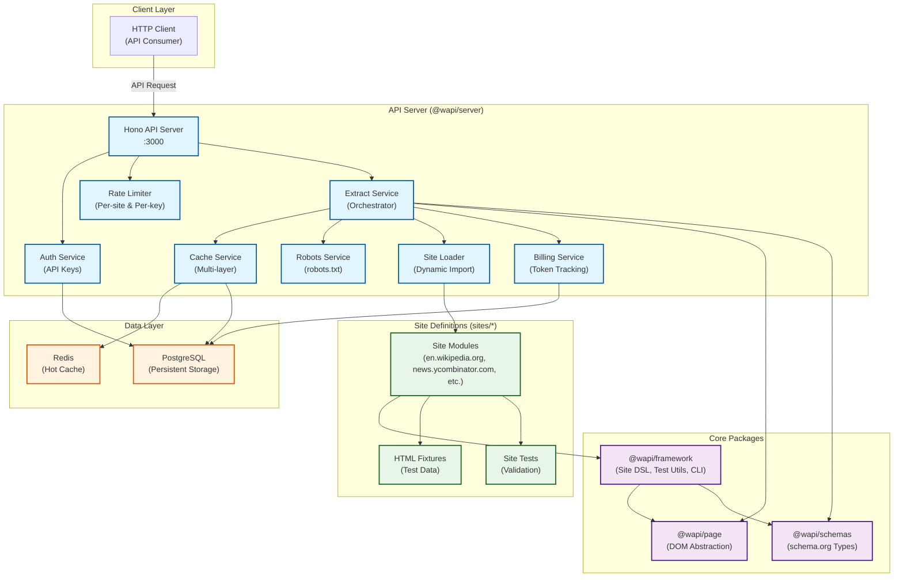

# WAPI Architecture

## Component Overview

### **API Layer** (`@wapi/server`)
- **Hono Server**: REST API handling HTTP requests
- **Auth Service**: API key generation and validation
- **Rate Limiter**: Per-site and per-API-key rate limiting
- **Extract Service**: Orchestrates extraction workflow
- **Cache Service**: Multi-layer caching (Redis hot + Postgres cold)
- **Robots Service**: robots.txt enforcement
- **Billing Service**: Token usage tracking
- **Site Loader**: Dynamic loading of site definitions

### **Core Packages**
- **@wapi/framework**: Site definition DSL, extraction context, test utilities, CLI tools
- **@wapi/page**: DOM abstraction layer (PageElement, PageDriver, CheerioDriver)
- **@wapi/schemas**: Hand-written schema.org TypeScript types

### **Site Definitions**
- **Site Modules**: TypeScript modules defining URL patterns, extraction logic, and validation
- **HTML Fixtures**: Saved HTML for testing extractors
- **Tests**: Vitest-based tests ensuring extraction accuracy

### **Data Storage**
- **Redis**: Hot cache for frequently accessed data (TTL-based)
- **PostgreSQL**: Persistent storage for users, API keys, cached extractions, and usage logs

## Request Flow

1. **Client** sends HTTP request with API key
2. **Auth Service** validates API key
3. **Rate Limiter** checks request limits
4. **Extract Service** orchestrates extraction:
   - Checks **Cache Service** (Redis → Postgres)
   - Validates **robots.txt** via Robots Service
   - Loads site definition via **Site Loader**
   - Fetches HTML if not cached
   - Runs extraction using **@wapi/framework** + **@wapi/page**
   - Returns schema.org-typed JSON
5. **Billing Service** tracks token usage
6. Response sent to client

## Key Features

- **Typed Output**: All responses conform to schema.org types
- **Fallback Extraction**: Unknown sites return JSON-LD, OpenGraph, and meta tags
- **Request Coalescing**: Duplicate in-flight requests are merged
- **Testable**: Site definitions run against fixtures in CI
- **Extensible**: New sites added as TypeScript modules