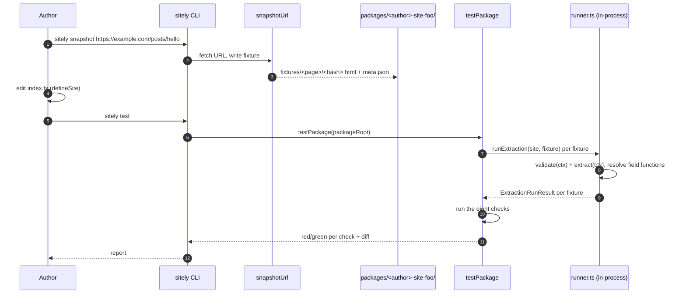
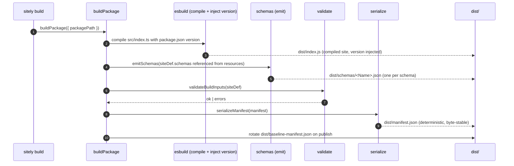
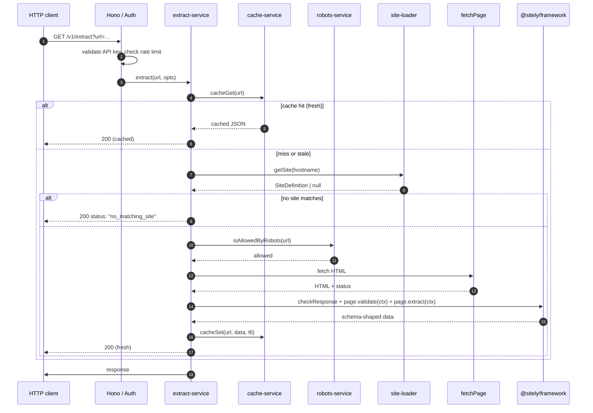

# Data flow

Three flows make up sitely: **author flow** (write a [site definition](/overview/glossary#site-definition), capture [fixtures](/overview/glossary#fixture), run tests), **build flow** (emit the [manifest](/overview/glossary#manifest)), and **runtime flow** (a consumer's HTTP request becomes structured JSON). Each starts in a different place, but the manifest sits at the centre of all three.

## Author flow — iterating on a site definition

`sitely snapshot` is the only place a robots.txt opt-out exists on the author side — fixture capture is an explicit author-initiated action, not server-side traffic. The server runtime never opts out.

### Edge cases — author flow

**`sitely snapshot` hits a 404 (or any non-2xx).** The CLI prints the status code and exits non-zero. No fixture file is written. The author has the choice of fixing the URL or, if they want to test the not-found path, saving the response body as `<name>.error.html` for the error-path check.

**The fixture filename already exists.** `sitely snapshot` refuses to overwrite by default. Pass `--overwrite` to replace it, or pick a different name. The deterministic-build constraint means accidentally overwriting a fixture would silently change the package's test surface; the explicit flag exists to make that obvious.

**The snapshotted page renders client-side.** Cheerio sees no body content because there's no JavaScript runtime. The fixture captures the empty shell. The author either picks a different page driver (when one is available) or finds a server-rendered equivalent URL.

**`sitely test` finds zero fixtures.** `sitely test` exits non-zero with an explanatory message; the package can't reach [verified](/overview/glossary#verified) without at least one fixture per declared [page](/overview/glossary#page). (Pages with no fixture surface as a separate "declared-resource fixture coverage" warning in the warning-only set — see [The test suite](/guide/testing).)

**A fixture's `<name>.expected.json` drifts from what extract produces.** The `fixture-extraction` check fails with a structural diff. The author either updates the fixture (the site changed and the extractor caught up) or fixes the extractor (a regression).

## Build flow — emitting the manifest

The bundled `dist/index.js` is what both the server and the TypeScript client import. The manifest is the declarative summary for tooling.

### Determinism

- `build.commit` is the package's last source-touching commit, not `git HEAD`.
- `build.builtAt` is *the commit's author timestamp*, not `Date.now()`.
- Object keys serialize in lexicographic order.
- Numbers and dates round-trip identically across machines.

Any deviation breaks the `manifest-integrity` check.

### Edge cases — build flow

**A resource's TTL is outside the framework's sanity bounds.** The build rejects the input. Sanity bounds are: `min ≥ 1s`, `max ≤ 7d`, `default ∈ [min, max]`. Bounds outside the framework's sanity rules are a sign of either a typo or a misunderstanding of what TTL means — either way, the build refuses to encode them.

**A schema fails to compile to JSON Schema.** The `emitSchemas` step throws with the schema's name and the underlying validator-library error. Some validator features (e.g. function-typed validators, transforms) have no JSON Schema equivalent; the author has to choose a representable shape or use a different validator.

**`capturePackageSnapshot` finds untracked changes to source files.** The build records the current working-tree state, but the `manifest-integrity` check (run as part of `sitely test`) regenerates from the committed source and will diverge. The author commits the changes and rebuilds.

**The site definition declares an origin whose hostname isn't a valid host string.** `validateBuildInputs` rejects it before any I/O. Hostname format is a hard precondition for the server's by-hostname dispatch.

**Two declared [resources](/overview/glossary#resource) reference the same schema name, one of which doesn't exist in `schemas`.** `validateBuildInputs` rejects with the dangling reference. Every `schemaRef` must resolve.

**The same fixture name appears under two pages.** Fixture files are flat under `fixtures/`; the build sees the duplicate when it reverse-indexes fixtures into the per-page `fixtures?` list. It rejects with both page keys named.

## Runtime flow — a consumer's HTTP request

The orchestrator [coalesces](/overview/glossary#coalesce) duplicate in-flight requests by URL — N concurrent identical requests trigger one fetch and one [extraction](/overview/glossary#extract). Coalescing is per server process; two server instances behind a load balancer each coalesce their own traffic.

### Pagination

A page can declare `paginate.next(ctx)` returning the next URL or null. When a request supplies `maxPages > 1`, the orchestrator follows `next` until exhausted, the cap is hit, or the cursor pages out. Pagination state goes into `ExtractResult.pagination`; the cursor is opaque to the client.

### Robots.txt on the server path

The server gates every extraction on `isAllowedByRobots(url)`. There is no per-request override, no header, no admin flag. The response status `forbidden_by_robots` is the only outcome when robots disallows. Every extraction path goes through this gate — there's no generic-extraction bypass.

### Edge cases — runtime flow

**Cache fails mid-extract.** If `cacheGet` errors (Redis down, Postgres timeout), the server logs the failure and treats it as a miss. Extraction proceeds normally. If `cacheSet` errors after a successful extraction, the result still returns to the client; the cache write is best-effort.

**Robots.txt fetch times out.** The robots service has its own timeout (a few seconds). On timeout, the service returns "allowed" with a warning log and caches that decision for a short window so a flaky robots endpoint doesn't take a site offline for callers. The next request after the cache window re-fetches. This matches the broader bias toward serving over blocking (stale cache fallback on extract failure). See [server: robots-service](./server#robots-service-ts-—-robots-txt-fetcher-decision-cache).

**`fetchPage` returns a non-2xx status.** The fetch result carries the status; the framework calls `validate(ctx)` regardless. Most validators check `ctx.status === 200` early and return `false` on non-2xx. The server records `validate-false` and returns a structured error to the client. The response is not cached unless the site definition explicitly opts in to caching non-2xx (rare).

**`validate(ctx)` returns `false`.** The framework records the result and skips `extract`. The server returns a structured error (`validation_failed`) to the client. Not cached by default.

**`extract(ctx)` throws.** The framework catches the throw and returns `status: "error"` (or `status: "stale"` if a stale cached value exists past its TTL). Thrown [framework errors](/overview/glossary#framework-errors) (`RateLimitedError`, `BlockedError`, etc.) map to their specific consumer-facing status. Stale is better than nothing for most consumers.

**Extract hits the extract-timeout.** The runner caps each extract at `extractTimeoutMs` (default 30s). A hung selector returns `status: "error"` to the consumer; subsequent requests can fall back to stale cache.

**Coalescing race.** Ten clients request the same URL within the same tick. The orchestrator sees one in-flight extraction and attaches the other nine. If the extraction succeeds, all ten get the same result. If it fails, all ten get the same error — a single failure doesn't multiply.

**The hostname matches two installed site packages.** The loader registers in load order; the later one wins, and the loader emits a warning. This is treated as a configuration mistake at the operator level. See the [manifest page](./manifest) for the hostname-conflict rule.

**The URL matches no installed site package.** The server returns `status: "no_matching_site"` with `data: null` — there's no generic-extraction fallback. To add coverage, install or write a package for that site.

## Trust enforcement

There is a [future direction](/future/) for signing manifests and pinning trust between source, package, and server. The current runtime trusts the lockfile — what's installed is what runs. The `manifest-integrity` check covers per-package integrity, but cross-package and cross-publisher trust isn't enforced by the runtime yet.

## What every flow has in common

The manifest is what every flow either produces (build), consumes (runtime), or verifies (test). If you want to know whether two parts of the system can talk to each other, ask whether they agree on the manifest format. That's why the manifest types are the single shared dependency across the build pipeline and the runner — no other type module reaches across that boundary.
