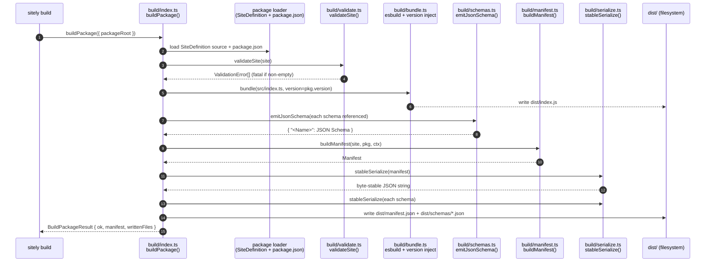

# @sitely/framework — build subsystem

The build subsystem (`packages/framework/src/build/`) is the single emitter of the [manifest](/overview/glossary#manifest). `buildPackage()` is the entrypoint; every other file in `build/` is a step that entrypoint composes. There is no other path to a manifest — not in the CLI, not in the test harness, not in the server runtime — and that exclusivity is what makes the chain `signed manifest → commit hash → npm provenance → tarball` possible. If `dist/manifest.json` exists, exactly one function produced it, and the bytes are reproducible from the source tree.

## What the subsystem owns

Three deliverables, all under `packages/site-*/dist/`:

| Artifact | Producer | Consumed by |
|---|---|---|
| `dist/manifest.json` | `serialize.ts` (writing what `manifest.ts` assembled) | Server site-loader, `manifest-integrity` check, directory, signing chain |
| `dist/schemas/<Name>.json` | `schemas.ts` | `schema-emission-roundtrip` check, directory schema lookups |
| The `BuildPackageResult` returned to callers | `index.ts` | The `sitely build` CLI command, the test harness (which invokes `buildPackage` with `dryRun: true` for integrity comparison) |

The subsystem also exports a cheaper *validation-only* lane (`validatePackage`) for authoring tools and watch modes. That lane runs the same static rules as a full build but writes nothing.

## What `sitely build` does

`sitely build` composes the pipeline:

1. **Load** the [site definition](/overview/glossary#site-definition) source and `package.json` from disk.
2. **Validate** the site definition against the static rules (`validateSite()`).
3. **Bundle** — compile `src/index.ts` via esbuild, inject `site.version` from `package.json`, write `dist/index.js`. Consumers (server + client) import this.
4. **Emit JSON Schemas** — one sidecar file per schema referenced from a resource (`emitJsonSchema()`).
5. **Assemble the manifest** — every field derived from the site definition, the `package.json`, and the source commit (`buildManifest()`).
6. **Serialize deterministically** — sort keys, pin numeric format, write to disk (`stableSerialize()`).
7. **Rotate baseline** (on `--publish` only) — copy the freshly-built manifest to `dist/baseline-manifest.json` so future `semver-discipline` checks diff against this release.



The same shape with `dryRun: true` skips the final filesystem step and returns the in-memory manifest + JSON strings instead — this is what the `manifest-integrity` check calls when it byte-compares the committed manifest against a fresh rebuild.

## Baseline source for `semver-discipline`

The `semver-discipline` check diffs the freshly-built manifest against a *baseline* — the previously-published manifest. Two sources are supported:

| Source | When used | Flag |
|---|---|---|
| **`dist/baseline-manifest.json`** (committed) | Default. Offline, deterministic, version-pinned to the last `--publish` rotation. CI runs against this. | (default) |
| **`npm view <package>@latest`** | On-demand check against whatever is actually on the registry. Useful when the committed baseline drifted out of sync (e.g. a publish that skipped the rotation step). | `--baseline npm` |

The baseline file rotates forward only on `sitely build --publish`. Plain `sitely build` regenerates `dist/manifest.json` but leaves `dist/baseline-manifest.json` untouched. The split keeps `--publish` as the single gate where SemVer is locked in.

**Strict by default in both directions.** `semver-discipline` fails the check if:

- Breaking changes (resource removed, schema field removed, optional→required, type narrowed, page URL pattern changed) lack a major bump.
- Additive changes (resource added, optional field added, type widened) lack at least a minor bump.

Pass `--allow-missing-minor-bump` to demote the additive-without-minor case to a warning — useful when you're intentionally batching multiple additive changes into the next major and don't want each intermediate `pnpm publish --dry-run` to fail.

## Determinism

The manifest can be signed only if it can be regenerated byte-identically. The `manifest-integrity` check re-runs the build at HEAD and asserts byte-equality with the committed `dist/manifest.json`. A failure here is not a flake — it is a defect in the build pipeline that has to be fixed before the package can ship.

The determinism rules every module in `build/` is expected to honour:

- **Sorted keys at every depth.** `serialize.ts` lexicographically sorts object keys; assemblers that emit `Record<>` values must not depend on insertion order downstream.
- **No wall-clock contamination.** `manifest.ts` derives `build.builtAt` from the package's last source-touching commit timestamp, never `Date.now()`. `build.commit` is the package-scoped commit, not `git HEAD`, so unrelated changes elsewhere in the monorepo don't perturb the manifest.
- **No locale drift.** Numbers are dot-decimal, dates are ISO-8601 UTC. `serialize.ts` does not call any `toLocaleString`-style method.
- **No iteration-order leakage.** `Set` and `Map` values that appear in the manifest are converted to sorted arrays / sorted-key records before serialization.
- **No environment leakage.** No `process.env.*`, `os.hostname()`, or `os.userInfo()` values appear in the output. The only inputs that affect the manifest are the source tree at the package commit and the build tool version string.
- **Pinned tool fingerprint.** `build.tool` records the `@sitely/framework@<version>` that built the manifest, so a framework version bump that legitimately changes the manifest is observable in the diff.

## Module-by-module

### `index.ts` — the public surface

```ts
export interface BuildPackageOptions {
    packageRoot: string;
    dryRun?: boolean;
    tool?: string;
}

export interface BuildPackageResult {
    ok: boolean;
    errors: ValidationError[];
    manifest?: Manifest;
    manifestJson?: string;
    schemas?: Record<string, string>;
    writtenFiles?: string[];
}

export async function buildPackage(opts: BuildPackageOptions): Promise<BuildPackageResult>;
```

Composes the pipeline from the other modules in the subsystem. Loads the package's `SiteDefinition` source and `package.json` from `packageRoot`, runs static validation, bundles `src/index.ts` with the version injected, emits per-schema JSON Schemas, assembles the manifest, serializes everything, and (unless `dryRun`) writes to `dist/`.

The result type is structured rather than a thrown error so callers can present validation failures *en masse*. The CLI's `sitely build` maps `ok === false` to exit code 1 after printing the errors; the test harness reads `manifestJson` for byte-comparison without touching the filesystem.

`index.ts` also re-exports the entire public build surface — `validatePackage`, `snapshotUrl`, `resolveCapabilities`, `parseTTL`, `stableSerialize`, and the `Manifest` / `ValidationError` types — so consumers import from `@sitely/framework/build` rather than reaching into individual modules.

**Why a single entrypoint:** centralising orchestration here is what makes "the build subsystem is the only emitter" enforceable. Any future step (cosign signing, SBOM emission, framework-version compatibility recheck) lands in `buildPackage` and is automatically subject to the same determinism rules as everything else.

### `manifest-types.ts` — the contract

Pure type module. Defines `Manifest` and every nested record (`ManifestSite`, `ManifestOrigin`, `ManifestLocales`, `ManifestParam`, `ManifestTTL`, `ManifestResource`, `ManifestPage`, `ManifestSchema`, `ManifestCapabilities`, `ManifestFramework`, `ManifestBuild`). No runtime code, no imports beyond TypeScript itself.

This module is the wire-format contract. Cross-package consumers of the manifest — the server's site-loader, the directory, the test harness — import these types from `@sitely/framework/build` and structurally match. The detailed field-by-field reasoning lives in [The build manifest](./manifest).

**Why it's a separate module:** keeping types isolated means the runtime, the directory, and the signing chain can depend on the manifest shape without pulling in the file-system, child-process, and git plumbing of `index.ts`. The chain reads manifests; it doesn't build them.

### `manifest.ts` — assembly

```ts
export interface BuildContext {
    packageRoot: string;
    tool: string;
}

export function buildManifest(
    site: SiteDefinition,
    pkg: { name: string; version: string },
    ctx: BuildContext,
): Manifest;
```

Turns a `SiteDefinition` + `package.json` metadata + a `BuildContext` into a structurally complete `Manifest`. Walks the builder-accumulated resources and pages to populate per-resource entries, derives `pages.*.provides` by dry-running each page's `extract` on its first fixture and collecting the returned keys, computes `family` if the site declared one, and pins `build.commit` + `build.builtAt` from `git log` on `packageRoot`.

**Edge case: the source-touching commit can't be determined.** If `git log` finds no commits that touch the package directory (e.g. the package was just scaffolded and not yet committed), the build fails with a clear error: "no source commit for `<packageRoot>` — commit your work before running `sitely build`". The manifest will not be assembled with `build.commit: null` — every signed manifest carries a real commit hash.

**Determinism contract:** identical inputs at the same package commit produce identical output. That means no `Date.now()`, no random IDs, no environment reads — everything is a function of the source tree.

**Why it's split from `index.ts`:** assembly is a pure transformation (`(site, pkg, ctx) → Manifest`); writing files is I/O. Splitting them lets the test harness call `buildManifest` directly when it wants to introspect the manifest *before* serialization (rare, but useful for diagnostics).

### `bundle.ts` — esbuild + version injection

```ts
export interface BundleOptions {
    packageRoot: string;
    entry: string;        // typically "src/index.ts"
    version: string;      // from package.json
    outFile: string;      // typically "dist/index.js"
}

export async function bundle(opts: BundleOptions): Promise<void>;
```

Wraps esbuild to produce `dist/index.js` with the `version` baked in as a build-time constant. The author writes no `version` field — `defineSite({ site: { id, displayName, version: __SITELY_VERSION__ } })` where `__SITELY_VERSION__` is an esbuild `define` replaced by the actual string. Consumers (server + browser) import the compiled output with the version intact.

**Why bundling lives here:** without it, browser consumers couldn't read `package.json` at runtime. Centralising version injection in `sitely build` means authors never thread the version through their code.

### `schemas.ts` — JSON Schema emission

```ts
export function emitJsonSchema(schema: StandardSchemaV1, _name: string): Record<string, unknown>;
```

Emits a JSON Schema sidecar (`dist/schemas/<Name>.json`) for each [Standard Schema](/overview/glossary#standard-schema) declared in the site definition. The manifest's `schemas.<Name>.$ref` points at the sidecar; the sidecar is what the directory displays and what the `schema-emission-roundtrip` check validates extracted output against.

Only Zod is supported today. Future revisions dispatch on `~standard.vendor` (`"valibot"`, `"arktype"`, …) to pick the right adapter. The Standard Schema interface is what gives this dispatch a stable signature.

**Edge case: a schema with no `schemaOrgType` tag.** Author-supplied schemas that aren't in `@sitely/schemas`'s catalogue won't have an entry in `schemaOrgMetadata`. This is allowed — the build sets `schemaOrgType: null` in the manifest for those entries. The directory groups them under "custom"; the validator still runs.

**Why it's a separate module:** schema emission is the one piece of the pipeline that may legitimately grow over time as more validator vendors are added. Isolating it means new adapters land here without touching the manifest assembly or serialization layers.

The `schema-emission-roundtrip` check closes the loop: every fixture's extracted output is validated against the *emitted* JSON Schema (not the original Standard Schema). If an extracted document validates against the Standard Schema but not the emitted JSON Schema, the emitter is wrong, and the directory and downstream consumers would see a misleading shape. The check catches this before publish.

### `serialize.ts` — the deterministic writer

```ts
export function stableSerialize(value: unknown): string;
```

The only function in the subsystem allowed to turn an object into bytes that get written to disk. Sorts keys lexicographically at every depth, tab-indents, ends with a trailing newline, and uses dot-decimal numbers + ISO-8601 strings throughout.

**Determinism contract:** identical input bytes for identical input values; no `Date.now()`, no `process.env`, no random padding, no locale dependency. The `manifest-integrity` check compares the bytes this function produces against the bytes committed in `dist/manifest.json`; if they differ for the same inputs at the same commit, the build is non-deterministic and the package cannot ship.

**Why it's a separate module:** keeping serialization isolated lets the test harness call it from the integrity check (`stableSerialize(buildManifest(...))`) without going through file I/O. It also makes the determinism contract easy to audit — anything that doesn't go through `stableSerialize` is, by construction, not a manifest.

### `snapshot.ts` — fixture authoring

```ts
export interface SnapshotUrlOptions {
    url: string;
    packageRoot: string;
    locale?: string | null;
    name?: string;
    userAgent?: string;
    skipIfExists?: boolean;
}

export interface SnapshotMeta {
    url: string;
    status: number;
    headers: Record<string, string>;
    fetchedAt: string;
    contentLength: number;
}

export async function snapshotUrl(opts: SnapshotUrlOptions): Promise<SnapshotResult>;
export function urlToFixtureName(url: string): string;
```

Fetches a live URL and persists it as a replay [fixture](/overview/glossary#fixture) under `fixtures/<locale>/<name>.html` plus a sibling `.meta.json`. This is what `sitely snapshot` invokes when an author seeds or refreshes a fixture; it is *not* part of the manifest build pipeline.

Three subtleties matter:

- **`snapshotUrl` is the only network egress in the entire framework build subsystem.** Manifest emission and validation are offline — they only read the package tree.
- **Robots.txt is opt-out here.** This is an explicit, author-initiated action on the author's own machine; the [server's runtime path](./server#robots-on-the-request-path) treats robots as invariant.
- **The `.meta.json` is serialized through `stableSerialize`** — fixture metadata is byte-stable for the same reason manifests are: so re-snapshotting an unchanged page produces a no-op diff.

**Why it's in `build/`:** it shares the snapshot-meta serialization plumbing with the rest of the build subsystem, and authoring and building are the same "build-time only" tier. It is never invoked at runtime.

### `ttl.ts` — duration parsing

```ts
export function parseTTL(s: string): number | null;

export interface TTLValidationError {
    resource: string;
    field: "default" | "min" | "max" | "ordering" | "ceiling" | "floor";
    message: string;
}

export function validateTTL(resourceName: string, ttl: ResourceTTL): TTLValidationError[];
```

Parses TTL strings (`"30s"`, `"1h"`, `"24h"`) into seconds and validates a [resource](/overview/glossary#resource)'s `{ default, min, max }` triple against the framework's bounds. The `field` discriminator distinguishes a malformed string (`"default"`) from a logical error (`"ordering"`: `min > max`; `"ceiling"`: `max > framework ceiling`; etc.).

**Edge case: TTL out of bounds.** A resource with `ttl: { default: "0s", min: "5m", max: "24h" }` fails the build with the field path: `resources.post.ttl.default: must be ≥ resources.post.ttl.min (5m)`. A resource with `ttl: { default: "1h", min: "5m", max: "999d" }` fails with `resources.post.ttl.max: exceeds framework ceiling (30d)`. Every error names the exact field path so the author can find it.

**Why it's a separate module:** TTL parsing is small but easy to get wrong, and it's used in two places — `validate.ts` (build-time) and the server's TTL-clamp logic (runtime). Re-exporting `parseTTL` from `@sitely/framework/build` lets the runtime share the exact same parser without depending on the rest of the build subsystem.

### `validate.ts` — pre-emission static rules

```ts
export interface ValidationError {
    kind:
        | "missing-schema-ref"
        | "ttl"
        | "locale-mismatch"
        | "resource-not-provided"
        | "page-provides-unknown"
        | "page-example-no-match"
        | "page-example-not-in-locale-set"
        | "family-shape-without-flag"
        | "missing-locale-default"
        | "missing-origins"
        | "missing-site-id";
    message: string;
    context?: Record<string, unknown>;
}

export function validateSite(site: SiteDefinition): ValidationError[];
```

The static-rule layer. Catches structural defects before the manifest assembles, so the assembly code can assume its inputs are sane:

- **`missing-schema-ref`** — a resource references a schema name that isn't declared.
- **`ttl`** — TTL parse or bound errors (delegated to `validateTTL`).
- **`locale-mismatch`** — locales are declared but the `default` isn't in `values`, or example URLs aren't in the locale set.
- **`resource-not-provided` / `page-provides-unknown`** — the page→resource graph isn't consistent (resource declared but no page provides it; page claims to provide an undeclared resource).
- **`page-example-no-match`** — an author-supplied example URL doesn't match the page's URL pattern.
- **`family-shape-without-flag`** — the site has multiple origins that look [family](/overview/glossary#family)-shaped but no `family` declaration.
- **`missing-locale-default` / `missing-origins` / `missing-site-id`** — required fields absent.

Errors are returned as an array, not thrown, so the CLI can print all of them at once.

**Edge case: package layout missing required directories.** `validateSite` does not check the filesystem — that happens upstream in `buildPackage`'s package loader. A package missing `fixtures/`, missing `package.json`, or missing the `index.ts` default export fails at load with an explanatory message before `validateSite` runs.

**Why it's a separate module:** the same rule set runs in two contexts — full builds (`buildPackage`) and watch-mode authoring (`validatePackage`). Pulling the in-memory rules out of the I/O wrapper lets both paths share the implementation without duplicating any logic.

### `validate-package.ts` — the watch-mode lane

```ts
export interface ValidatePackageOptions {
    packageRoot: string;
}

export interface ValidatePackageResult {
    ok: boolean;
    errors: ValidationError[];
    site?: SiteDefinition;
}

export async function validatePackage(opts: ValidatePackageOptions): Promise<ValidatePackageResult>;
```

The cheap lane: load the SiteDefinition from disk, run `validateSite`, return the result. No bundling, no schema emission, no manifest assembly, no file writes. Used by authoring tools (and, eventually, the LSP) to surface structural errors before the author commits to a full `sitely build`.

`validatePackage` is a *subset* of `buildPackage`'s work — every error `validatePackage` finds, `buildPackage` would also find — so the two can never disagree about whether a package is structurally valid.

**Why it's a separate module:** the watch-mode loop runs on every keystroke. Excluding bundling + schema emission + git + filesystem writes is what makes it fast enough to be interactive.

## The checks that touch build outputs

Two of the eight checks consume what this subsystem produces:

| # | Check | What it asserts about build outputs |
|---|---|---|
| 4 | `schema-emission-roundtrip` | Every fixture's extracted output validates against the *emitted* JSON Schema in `dist/schemas/<Name>.json`. Catches divergence between the Standard Schema validator and the JSON Schema artifact the directory will surface. |
| 7 | `manifest-integrity` | A fresh `buildPackage({ dryRun: true })` at HEAD produces a manifest byte-identical to the committed `dist/manifest.json`. Catches every form of non-determinism (key order, locale drift, `Date.now()`, environment leakage). |

Both checks live in [`packages/framework/src/test-pkg/checks.ts`](./framework-test-pkg). The build subsystem doesn't run them — but it is structured precisely so they can pass. Every determinism rule, every pure-function split, every single-emitter constraint exists so #7 can succeed on every commit.

The other six checks (`fixture-extraction`, `schema-conformance`, `determinism`, `locale-matrix`, `error-path-coverage`, `semver-discipline`) read the manifest as input but don't probe build internals; they live entirely on the [test-pkg side](./framework-test-pkg).

## Where the build subsystem is **not** called

- **At runtime.** The server's site-loader reads `dist/manifest.json` directly; it never reconstructs one. The build subsystem and runtime have no shared mutable state.
- **Across packages.** Each `buildPackage` invocation is scoped to one package root. There is no monorepo-wide build step that crosses packages — manifests are independently reproducible per package.
- **From inside extract.** The site code that runs `validate(ctx)` + `extract(ctx)` has no access to `buildPackage`; the manifest is the system's view, not the extractor's.

## Read next

- [The build manifest](./manifest) — every field, every contract, every consumer.
- [@sitely/framework — test-pkg subsystem](./framework-test-pkg) — what runs the manifest the build subsystem produced.
- [Glossary](/overview/glossary) — `manifest`, `URL pattern`, `Standard Schema`, `family`.
