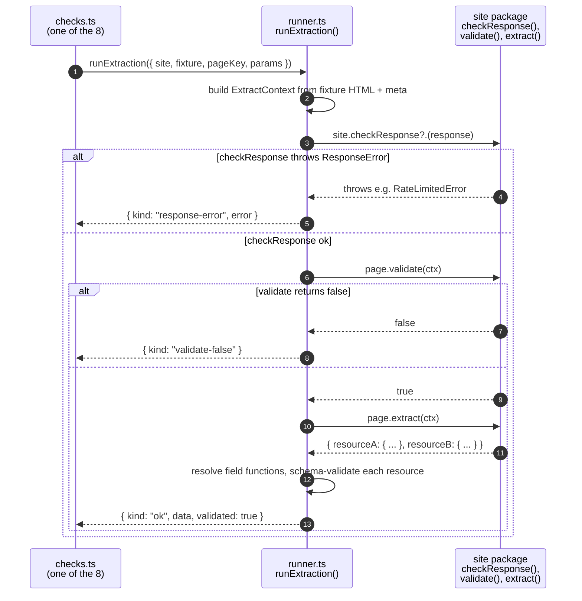

# @sitely/framework — test-pkg subsystem

The test-pkg subsystem (`packages/framework/src/test-pkg/`) is what `sitely test` runs. It discovers the package's [fixtures](/overview/glossary#fixture), executes each page's `validate(ctx)` + `extract(ctx)` in-process, runs the eight checks against the results, and posts the verdict back to CI.

Site code runs in the same Node process as the harness — no isolation layer. The trust model is "you install what you trust", same as any npm dependency. Isolation for managed/hosted runtimes (where untrusted packages execute on operator infrastructure) is a service-layer concern; see [future direction](/future/).

## The eight checks

Each check is one function in [`checks.ts`](#checks-ts-the-eight-checks). Names appear in CI output exactly as listed; they're stable identifiers CI scripts and dashboards can match on.

| # | Check name | Asserts |
|---|---|---|
| 1 | `fixture-extraction` | Every fixture's extracted output matches its `expected.json`. |
| 2 | `schema-conformance` | Extracted output conforms to the resource's declared [Standard Schema](/overview/glossary#standard-schema). |
| 3 | `determinism` | Re-running extraction on the same fixture twice yields byte-identical output. |
| 4 | `schema-emission-roundtrip` | Extracted output validates against the *emitted* `dist/schemas/<Name>.json` (not just the in-process validator). |
| 5 | `locale-matrix` | Multi-[locale](/overview/glossary#locale) sites carry fixtures for ≥2 declared locales. |
| 6 | `error-path-coverage` | Fixtures marked `errorCase: true` cause `validate(ctx)` to return `false`. |
| 7 | `manifest-integrity` | A fresh `buildPackage({ dryRun: true })` at HEAD produces bytes identical to the committed `dist/manifest.json`. |
| 8 | [`semver-discipline`](/overview/glossary#semver-discipline) | Manifest diff against `dist/baseline-manifest.json` matches the version bump in `package.json`. Breaking changes require a major bump; additive changes require a minor bump. |

**Warning-only checks** surface in CI output but don't block:

- `fixture-freshness` — fixture is older than 90 days (warns) or 365 days (fails).
- `performance-budget` — extraction wall time exceeds an internal soft budget.
- `ttl-plausibility` — a resource's `ttl.default` looks off for its content cadence (heuristic).
- `fixture-coverage` — for every `.optional()` / `.nullable()` / `.nullish()` field in a resource's schema, fixtures collectively cover both the present and the absent case.

Two checks reach back into the [build subsystem](./framework-build): #4 reads the emitted JSON Schemas; #7 re-runs the entire build; #8 diffs against the baseline manifest.

## The worker lifecycle

Per check, the harness runs each fixture's `validate(ctx)` + `extract(ctx)` in the same process as itself. No worker spawn, no isolation overhead.



A timeout (`policy.extractTimeoutMs`, default 30s) wraps each extract call so a hung selector doesn't block the harness. Throws — including thrown [framework errors](/overview/glossary#framework-errors) — surface as the matching `ExtractionRunResult` variant.

## `ExtractionRunResult` — the discriminated union

```ts
export type ExtractionRunResult =
    | { kind: "ok"; data: Record<string, unknown>; validated: boolean }
    | { kind: "response-error"; error: ResponseError }
    | { kind: "extraction-error"; error: ExtractionError; field?: string }
    | { kind: "validate-false" }
    | { kind: "validation-error"; issues: SchemaIssue[] }
    | { kind: "error"; message: string };
```

Each check decides what each variant means for its assertion:

- **`ok`** — happy path. Used by `fixture-extraction`, `schema-conformance`, `determinism`, `schema-emission-roundtrip`.
- **`response-error`** — `checkResponse` (or extract) threw a [`ResponseError`](/overview/glossary#framework-errors). On a happy-path fixture this fails `fixture-extraction` (the fixture should have been recognised as valid).
- **`extraction-error`** — extract or a [field function](/overview/glossary#field-function) threw an [`ExtractionError`](/overview/glossary#framework-errors). The `field` discriminator names the offending field when known.
- **`validate-false`** — `validate(ctx)` returned `false`. On a happy-path fixture this is a `fixture-extraction` failure; on an `errorCase: true` fixture it's the expected result and `error-path-coverage` (#6) treats it as success.
- **`validation-error`** — the framework's schema validation rejected extract's output. `fixture-extraction` and `schema-conformance` both fail in this case.
- **`error`** — anything else: timeout, uncaught exception, OOM. Always a failure; `message` is surfaced in CI output.

## Edge cases for the test harness

### A fixture has no `expected.json`

`fixture-extraction` (#1) fails for that fixture with an explanatory message: "fixture `<hash>` has no `expected.json` — add one with the data extraction should produce, or remove the fixture if it's not yet captured". The fixture is still useful for `determinism` (#3), which doesn't read `expected.json`.

### The extract-call timeout fires

The runner caps each extract at `policy.extractTimeoutMs` (default 30s). A fixture that exceeds it gets `{ kind: "error", message: "extract timeout" }`. Authors who legitimately need longer can raise the timeout per-fixture via the fixture's meta — but if a fixture takes that long, the extractor probably has a problem.

### `locale-matrix` with only one declared locale

If a site declares `locales: { values: ["en"], default: "en" }`, `locale-matrix` (#5) is **skipped, not failed**. The check exists to catch multi-locale declarations with single-locale fixtures; a single-locale declaration has nothing to spread across. Sites that genuinely have only one locale should omit the `locales` block entirely.

### An `errorCase: true` fixture whose `validate` returns `true`

`error-path-coverage` (#6) inverts the polarity of `validate`. A `true` return on an error-case fixture means the `validate` function is too permissive — the failure message names the fixture and the page key.

### `semver-discipline` with no baseline

If `dist/baseline-manifest.json` doesn't exist (first publish), the check passes trivially with a note. The first run after `npm publish` writes the baseline.

### `fixture-coverage` warning

For every field with `.optional()`, `.nullable()`, or `.nullish()` in a resource's schema, the warning fires if no fixture has the field present *or* no fixture has it absent. Doesn't block, but signals that one branch of the extractor's behaviour isn't tested.

## Module-by-module

### `index.ts` — the public surface

```ts
export async function testPackage(opts: TestPackageOptions): Promise<TestPackageResult>;

export type {
    CheckFailure,
    CheckName,
    CheckResult,
    TestPackageOptions,
    TestPackageResult,
} from "./types.js";
```

Loads the [site definition](/overview/glossary#site-definition), discovers fixtures (`fixtures.ts`), assembles a `CheckContext`, dispatches the requested checks. `opts.only` lets the CLI run a subset (`sitely test --only manifest-integrity`); the default runs all eight plus the warning-only set. `result.ok === false` maps to exit code 1.

### `types.ts` — stable identifiers

```ts
export type CheckName =
    | "fixture-extraction"
    | "schema-conformance"
    | "determinism"
    | "schema-emission-roundtrip"
    | "locale-matrix"
    | "error-path-coverage"
    | "manifest-integrity"
    | "semver-discipline";

export interface CheckFailure {
    check: CheckName;
    fixture?: string;
    locale?: string | null;
    page?: string;
    resource?: string;
    field?: string;
    message: string;
    detail?: unknown;
}

export interface CheckResult {
    check: CheckName;
    ok: boolean;
    failures: CheckFailure[];
    count: number;
}

export interface TestPackageOptions {
    packageRoot: string;
    only?: CheckName[];
}

export interface TestPackageResult {
    ok: boolean;
    results: CheckResult[];
    failures: CheckFailure[];
}
```

`CheckName` values are stable and consumer-matchable. Adding a check is a major version bump for the framework.

### `checks.ts` — the eight checks

```ts
export interface CheckContext {
    packageRoot: string;
    site: SiteDefinition;
    fixtures: Fixture[];
}

export async function runFixtureExtraction(ctx: CheckContext): Promise<CheckResult>;
export async function runSchemaConformance(ctx: CheckContext): Promise<CheckResult>;
export async function runDeterminism(ctx: CheckContext): Promise<CheckResult>;
export async function runSchemaEmissionRoundtrip(ctx: CheckContext): Promise<CheckResult>;
export function runLocaleMatrix(ctx: CheckContext): CheckResult;
export async function runErrorPathCoverage(ctx: CheckContext): Promise<CheckResult>;
export async function runManifestIntegrity(ctx: CheckContext): Promise<CheckResult>;
export async function runSemverDiscipline(ctx: CheckContext): Promise<CheckResult>;
```

Per-check notes:

- **`runFixtureExtraction`** — for each fixture, runs `validate` + `extract` via `runner.ts`, deep-equality compares `data` against `expected.json`. Records `validate-false`, mismatched output, and runner errors as failures.
- **`runSchemaConformance`** — for each happy-path fixture, validates the extracted output through the resource's Standard Schema `~standard.validate` method. A schema-conformance failure where `fixture-extraction` matches means the committed `expected.json` is wrong.
- **`runDeterminism`** — runs each fixture twice in fresh contexts, byte-compares the two `data` records. Catches `Math.random()`, `Date.now()`, iteration-order leakage, anything that varies across runs.
- **`runSchemaEmissionRoundtrip`** — emits each schema via `emitJsonSchema` (from [`build/schemas`](./framework-build)), then validates extracted output against the emitted JSON Schema. Catches divergence between the in-process validator and the artifact the directory will display.
- **`runLocaleMatrix`** — pure, synchronous. Asserts that any site declaring two or more locales has fixtures for at least two distinct declared locales. Skips single-locale declarations entirely.
- **`runErrorPathCoverage`** — runs `validate(ctx)` against each fixture marked `errorCase: true` and asserts the result is `false`. The inverse of `runFixtureExtraction` for error pages.
- **`runManifestIntegrity`** — invokes `buildPackage({ packageRoot, dryRun: true })`, calls `stableSerialize(result.manifest)`, byte-compares against the committed `dist/manifest.json`. The cross-subsystem closure: this check validates the build subsystem on every test run.
- **`runSemverDiscipline`** — diffs the freshly-built manifest against `dist/baseline-manifest.json` and asserts that the version bump in `package.json` is appropriate for the diff. Breaking changes require major; additive changes require minor; cosmetic changes can be any bump. See [`semver-discipline`](/overview/glossary#semver-discipline).

### `fixtures.ts` — discovery

```ts
export interface Fixture {
    pageKey: string;                         // which page this fixture exercises
    params: Record<string, string>;          // typed against the URL pattern at the call site
    locale: string | null;
    htmlPath: string;
    html: string;
    expected?: Record<string, unknown> | null;
    meta?: { url?: string; status?: number; headers?: Record<string, string> };
    isErrorFixture: boolean;
}

export function discoverFixtures(site: SiteDefinition, packageRoot: string): Fixture[];
```

Walks each page's inline `fixtures: [...]` declarations. For every entry `{ params, errorCase? }`:

1. Compute the canonical URL via `page.url.toUrl(params)`.
2. Compute the on-disk hash from `params` (stable across runs).
3. Read `<page-key>/<hash>.html`, `<page-key>/<hash>.expected.json` (unless error case), `<page-key>/<hash>.meta.json`.

Locale derives from the `params` (when one of the params matches the site's `locales.values`) or the meta. Fixtures with no locale association carry `locale: null`.

### `runner.ts` — in-process extraction

```ts
export type ExtractionRunResult =
    | { kind: "ok"; data: Record<string, unknown>; validated: boolean }
    | { kind: "response-error"; error: ResponseError }
    | { kind: "extraction-error"; error: ExtractionError; field?: string }
    | { kind: "validate-false" }
    | { kind: "validation-error"; issues: SchemaIssue[] }
    | { kind: "error"; message: string };

export interface ExtractionRunOptions {
    site: SiteDefinition;
    fixture: Fixture;
}

export function runExtraction(opts: ExtractionRunOptions): Promise<ExtractionRunResult>;
```

The in-process executor. Builds the [ExtractContext](/overview/glossary#extract-context) from the fixture's HTML + meta, calls `site.checkResponse?.(response)` if declared, then `page.validate(ctx)`, then `page.extract(ctx)`. Resolves field functions, validates against the resource schema, returns the discriminated result.

Errors:
- A thrown [`ResponseError`](/overview/glossary#framework-errors) becomes `{ kind: "response-error", error }`.
- A thrown [`ExtractionError`](/overview/glossary#framework-errors) becomes `{ kind: "extraction-error", error, field }`.
- Any other thrown error becomes `{ kind: "error", message }`.
- An exceeded extract timeout becomes `{ kind: "error", message: "extract timeout" }`.

## Implementation notes

These are details that don't appear in user-facing docs but matter for sitely engineers.

**Field-function execution order.** When extract returns `{ resource: { field1: () => ..., field2: () => ... } }`, the runner invokes field functions in declaration order, awaiting any that return Promises. Each is wrapped in try/catch — a throw is recorded as an extraction-error against that field (with `field: "resource.field1"`) and the field is treated as absent in the validated output. Other fields continue.

**`ctx.lazy` memoisation.** `ctx.lazy(fn)` returns a function that captures the first call's result (or thrown error) and replays it on subsequent calls. Errors are re-thrown to the caller, so a dependent field gets the same error instance as its sibling. Telemetry attributes failures to the upstream `lazy` producer rather than to N consuming fields.

**Fixture hashing.** The on-disk `<hash>` is `sha256(JSON.stringify(canonicalize(params))).slice(0, 12)` — short enough to be readable in `git status`, long enough to avoid collisions across realistic fixture sets.

**Schema validation pipeline.** After extract returns, each resource's value is validated via Standard Schema's `~standard.validate`. The result's `issues` array (if any) populates `validation-error`'s `issues` field. The schema-emission-roundtrip check runs validation a second time against the emitted JSON Schema (Ajv internally) — the two should agree.

## Read next

- [@sitely/framework — build subsystem](./framework-build) — the producer of the manifest this subsystem consumes (and re-validates via `manifest-integrity` + `semver-discipline`).
- [The build manifest](./manifest) — the single shared artifact.
- [@sitely/framework](./framework) — the DSL the harness loads.
- [Glossary](/overview/glossary).
