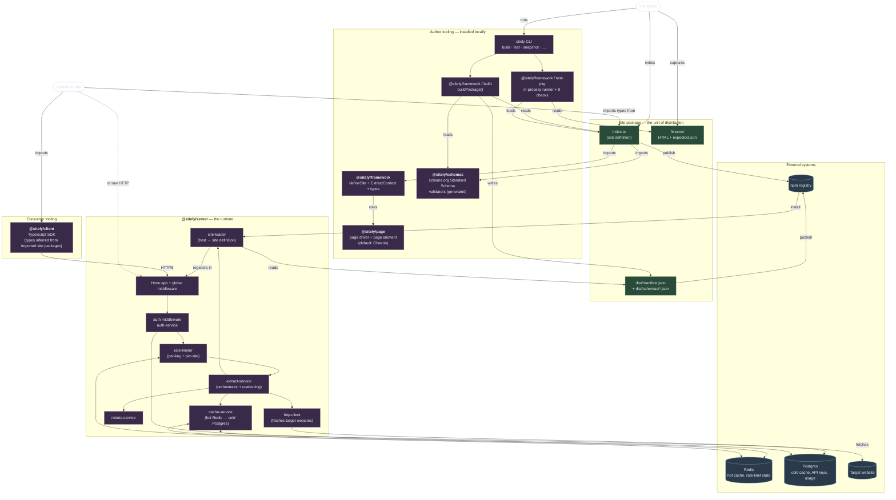
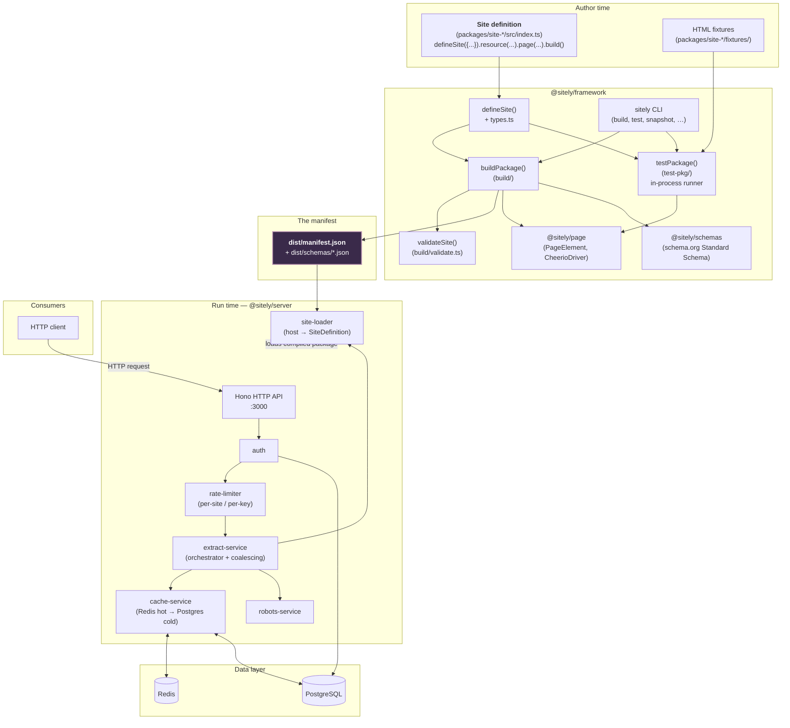

# Architecture overview

> **Design Preview.** sitely has no implementation yet. The architecture below is fully specified — module boundaries, data flow, contracts — so implementation can follow the design rather than the other way round. Statements like "the server loads X" describe the contract every implementation has to honour.

A five-minute mental model of how sitely turns a website into a typed JSON API. The deep dives for each subsystem live in the sidebar; this page is the map you orient against.

sitely has three layers — **author-time**, **build-time**, and **run-time** — joined by a single file that every layer reads or writes: the [manifest](/overview/glossary#manifest).

## The three layers

**Author-time.** You write a [site package](/overview/glossary#site-package): an `index.ts` chaining `defineSite({...}).use(...).build()` plus a `fixtures/` directory of HTML snapshots. You iterate with `sitely snapshot` (capture a fixture) and `sitely test` (run the eight checks against the fixtures). Nothing here talks to a server.

**Build-time.** `sitely build` compiles `src/index.ts` with the `version` from `package.json` baked in, writes `dist/index.js` plus `dist/manifest.json` and one JSON Schema per [schema](/overview/glossary#schema). The build is deterministic — same source, same bytes — so the manifest can be diffed, signed, and checked into git.

**Run-time.** `@sitely/server` loads installed site packages, indexes them by hostname, and serves an HTTP API. Each incoming URL is matched to a [page](/overview/glossary#page), fetched, then `checkResponse(response)` + `validate(ctx)` + `extract(ctx)` run in-process. Results are cached and returned as typed JSON.

## The building blocks

Everything sitely consists of, on one page:

Labels in **bold** are published npm packages. The boxes inside `@sitely/framework` are subsystems of that package; the boxes inside `@sitely/server` are modules within that package.

A few things to read off the diagram:

- **Six kinds of npm package.** Five sitely-published (`@sitely/framework`, `@sitely/page`, `@sitely/schemas`, `@sitely/server`, `@sitely/client`) plus the site packages — one per installed site. Site packages are normal npm packages, published either by the sitely org (`@sitely/site-*`) or by the community (`<author>-site-*`).
- **The manifest is the seam** between author-side tooling and server-side runtime. Author-side writes it; server-side reads it; the consumer's [TypeScript client](/guide/using-the-client) infers types from the site definition that produced it.
- **The TypeScript client and raw HTTP are both first-class.** Consumers pick. The HTTP API is the contract; the client is a convenience.
- **External systems are minimal.** Redis, Postgres, and the npm registry are all the server needs to operate. The target websites it fetches from are the fourth.
- **In-process extraction.** Author tooling and the server both execute the package's `validate`/`extract` in the same Node process they run in. What passes tests is what runs in production.

## The whole system

A second view, focused on the *flow* through the layers (the same components, drawn around how data moves):

## The package map

| Package | What it does | Deep dive |
|---|---|---|
| `@sitely/page` | The DOM abstraction. Defines [page driver](/overview/glossary#page-driver) and [page element](/overview/glossary#page-element) so [extract](/overview/glossary#extract) functions don't depend on Cheerio directly. The default driver wraps Cheerio; JSDOM or Playwright drivers can drop in later. | [@sitely/page](./page) |
| `@sitely/schemas` | Standard Schema validators generated from schema.org's published vocabulary. Authors import them and compose them into per-resource schemas — extend with site-specific fields, or replace entirely. | [@sitely/schemas](./schemas) |
| `@sitely/framework` | The DSL, the build pipeline, the test runner, and the `sitely` CLI. Everything between the author's source and the manifest. | [@sitely/framework](./framework) → [build](./framework-build) → [test-pkg](./framework-test-pkg) |
| `@sitely/server` | The runtime. Hono HTTP server, auth, cache, rate limit, robots service, extract orchestrator. Loads site packages by hostname and serves typed JSON. | [@sitely/server](./server) |
| `packages/site-*` | Site packages. One per site. Each ships `index.ts` (the site definition), `fixtures/` (test data), and `dist/manifest.json` (emitted by the build). | [Site packages](./sites) |

## The manifest is the single shared file

Every layer reads or writes the manifest:

- **Build** writes it.
- **Test** regenerates it from source and diffs against the committed copy — the `manifest-integrity` check.
- **Server load** reads it to register origins, cross-check the framework version range, and record the site's `version` for `409`-on-mismatch.
- **Directory** (when present) reads it to render schemas, resources, and locales.

`buildPackage()` is the only thing that emits a manifest. No other path produces one. Determinism is enforced: `build.commit` is the package's last source-touching commit; `build.builtAt` is that commit's author timestamp. Never `Date.now()`. See [The manifest](./manifest) for the full field-by-field walkthrough.

## The trust model in one paragraph

Site packages run in-process in the server and the test harness alike. The operator's `package-lock.json` is the trust boundary — the server loads what's installed, with no second policy file. This matches Node's default trust model for npm dependencies. A future managed/hosted service can add real isolation at the service layer (separate process, container, VM); the framework itself stays light. See [future direction](/future/).

## Read next

- [Data flow](./data-flow) — end-to-end traces for the author, build, and runtime flows.
- [The manifest](./manifest) — field by field.
- [@sitely/framework](./framework) — the DSL, the CLI, and the contract every site package implements.
