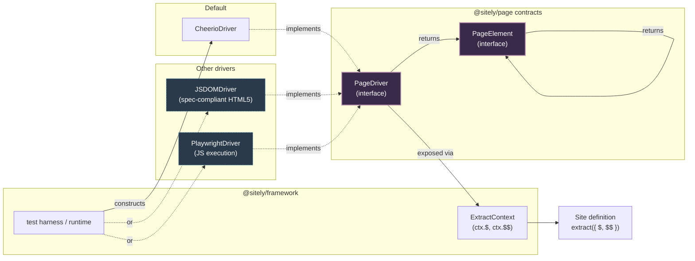

# @sitely/page

`@sitely/page` is the DOM abstraction layer. It defines the read-only [`PageElement`](/overview/glossary#page-element) and [`PageDriver`](/overview/glossary#page-driver) interfaces that the [framework](./framework) hands to every [extract](/overview/glossary#extract) function — when a [site definition](/overview/glossary#site-definition) calls `ctx.$("h1")` or `ctx.$$(".product")`, what comes back is a `PageElement` produced by whichever [driver](/overview/glossary#driver) the test harness or runtime instantiated. The package also ships the default Cheerio-backed driver. Authors never construct a driver directly; they read off the [extract context](/overview/glossary#extract-context).

## Why a DOM abstraction at all

Without this seam, every [site package](/overview/glossary#site-package) would import Cheerio directly. Cheerio is small, fast, and jQuery-shaped — but importing it directly leaks the parser into the public surface of every site definition. The cost shows up the first time a different parsing engine is needed:

- **JSDOM** for sites where the differences between Cheerio's HTML parser and a spec-compliant HTML5 parser matter (mis-nested tables, form-associated elements, template contents).
- **Playwright** or **Puppeteer** for sites that require JavaScript execution before the meaningful DOM exists.
- **A faster or smaller static HTML parser** in the future.

If extract functions talk to Cheerio directly, swapping the engine means rewriting every site package. If extract functions talk to `PageElement`, swapping the engine means writing one new driver that implements the interface — every existing site keeps working.

The split is not academic. The [test-pkg subsystem](./framework-test-pkg) and the server runtime both instantiate the driver themselves. Site code receives the result. Decoupling those two ends is what makes the engine swappable.



## The `PageDriver` contract

A driver parses one HTTP response, then answers queries about it.

```ts
export interface PageDriver {
    $(selector: string): PageElement | null;
    $$(selector: string): PageElement[];
    title(): string;
    html(): string;
    status: number;
    headers: Record<string, string>;
    url: string;
}
```

Three things about this shape:

1. **The driver carries response metadata.** `status`, `headers`, and `url` are response-level facts a parser would otherwise hide. Extract functions sometimes need them — for relative URL resolution, for detecting redirected canonicals, for branching on `Content-Language`. Putting them on the driver means an extract function never has to thread them in separately.
2. **`$` is single-or-null; `$$` is always an array.** No mystery half-states. A missing element returns `null`; a present element returns a `PageElement`; a multi-match returns the full list.
3. **The driver is the document root.** All traversal starts at the driver and descends through `PageElement`. There is no parallel "document" object.

### Edge cases for `$` and `$$`

The single most common question authors have is "what happens when nothing matches?" The contract is explicit:

| Call | Selector matches 0 nodes | Selector matches 1 node | Selector matches N nodes |
|---|---|---|---|
| `driver.$(sel)` | returns `null` | returns the `PageElement` | returns the **first** match |
| `driver.$$(sel)` | returns `[]` | returns `[el]` | returns `[el1, el2, …]` |

Two corollaries:

- `driver.$(sel) ?? NULL_ELEMENT` is the idiomatic way to "operate on a missing element as if it existed". The `NULL_ELEMENT` sentinel returns safe defaults for every operation.
- `driver.$$(sel).length === 0` is the same condition as `driver.$(sel) === null`. They never disagree.

A selector that fails to parse (`$("[[invalid")`) throws synchronously. This is a programmer error, not a missing-element case.

## The `PageElement` contract

`PageElement` is a read-only view of one node and its descendants.

```ts
export interface PageElement {
    $(selector: string): PageElement | null;
    $$(selector: string): PageElement[];
    text(): string;
    html(): string;
    attr(name: string): string | null;
    exists(): boolean;
    data(key: string): string | null;
    classes(): string[];
    next(): PageElement | null;
    prev(): PageElement | null;
    parent(): PageElement | null;
    children(): PageElement[];
    first(): PageElement;
}
```

The shape is intentionally narrow. There is no `.append()`, no `.attr(name, value)`, no `.remove()`. Extract functions read the DOM; they don't mutate it. A read-only surface rules out the class of "this extract function stomped on the source HTML and the next assertion broke" failures, and lets a driver back its results with frozen or shared objects.

### Edge cases for element methods

| Method | Element exists, has content | Element exists, no content | Element doesn't exist |
|---|---|---|---|
| `.text()` | the text | `""` | `""` (on `NULL_ELEMENT`) |
| `.html()` | the inner HTML | `""` | `""` |
| `.attr(name)` | the value (string) | `""` if attr present and empty; `null` if attr absent | `null` |
| `.exists()` | `true` | `true` | `false` |
| `.data(key)` | `data-<key>` value | `null` if attribute absent | `null` |
| `.classes()` | the class list | `[]` | `[]` |
| `.children()` | the child elements | `[]` | `[]` |
| `.first()` | the same element | the same element | `NULL_ELEMENT` |

Two recurring confusions:

- **An element that exists but has no text** returns `""` from `.text()`, *not* `null`. To distinguish "missing element" from "present but empty", use `.exists()`. The element `<h1></h1>` returns `""` from `.text()` and `true` from `.exists()`.
- **`attr(name)` returns `null` when the attribute is absent and `""` when the attribute is present with no value.** `<a href="">` and `<a>` are different cases. Authors who don't care should write `.attr("href") ?? ""`.

`.first()` returns a `PageElement`, not `PageElement | null`, because every `PageElement` is already "first" in its own scope. The method exists for clarity at use-sites that operate on a fluent chain. On `NULL_ELEMENT`, `.first()` returns `NULL_ELEMENT`.

## The default: `CheerioDriver`

The Cheerio driver is the default. It parses static HTML — what an `http_get` returns — and exposes it through the interface above.

```ts
export interface CheerioDriverOptions {
    rawHtml: string;
    url: string;
    status?: number;
    headers?: Record<string, string>;
}

export class CheerioDriver implements PageDriver {
    readonly status!: number;
    readonly headers!: Record<string, string>;
    readonly url!: string;

    constructor(opts: CheerioDriverOptions);

    $(selector: string): PageElement | null;
    $$(selector: string): PageElement[];
    title(): string;
    html(): string;
}
```

The driver takes the raw HTML plus the metadata it needs to make the response queryable. Defaults are conservative: `status` defaults to `200`, `headers` to `{}`. This keeps the constructor ergonomic for fixture-driven tests, which is the most common construction site — the [test-pkg subsystem](./framework-test-pkg) loads an HTML [fixture](/overview/glossary#fixture) and wraps it.

### Edge cases for malformed input

Cheerio is forgiving. The driver inherits that:

- **Empty string.** `new CheerioDriver({ rawHtml: "", url })` constructs successfully. `$("anything")` returns `null`. `title()` returns `""`.
- **Not HTML at all** (e.g. JSON, plain text). Cheerio wraps the content in an implicit `<html><body>` and treats the content as text. `$("body")?.text()` returns the original string. No throw.
- **Mis-nested tags** (`<b><i></b></i>`). Cheerio applies a best-effort fix-up. The result roughly matches what a browser does. Don't rely on the exact tree shape for adversarial input.
- **Truncated HTML** (the response ended mid-tag). Cheerio closes the open tags. Extract functions should not assume that "the document parsed" means "the document is complete" — check `status` and `headers["content-length"]` on the driver if it matters.
- **Massive documents.** Cheerio parses synchronously and loads the full tree into memory. If a fetched document is large enough to exhaust process memory, the runtime catches the failure and surfaces `status: "error"`; the orchestrator records it against the per-host [circuit breaker](/overview/glossary#circuit-breaker). Use the `FETCH_MAX_BYTES` server cap to refuse oversize responses up front.

### Limits

The Cheerio driver is a static-HTML parser:

- **No JavaScript execution.** A site that renders its content via client-side JS produces a near-empty DOM from this driver's perspective. Such sites need a future Playwright-class driver, or — better — a per-site adapter that targets the site's API directly.
- **Cheerio's HTML parser is not spec-strict.** For the vast majority of pages this doesn't matter. For pages that rely on the [HTML5 parsing algorithm's](https://html.spec.whatwg.org/multipage/parsing.html) more exotic rules (mis-nested form elements, certain table fragment cases), JSDOM would parse differently. The abstraction means a driver can be swapped per-site without touching the extract function.
- **Selectors are CSS-only.** No XPath. Extract functions that need XPath usually need a tighter selector strategy first.

## The `NULL_ELEMENT` sentinel

`NULL_ELEMENT` is a singleton `PageElement` that returns safe defaults for every operation: empty strings, empty arrays, `null` for attribute reads, `false` for `exists()`. It exists for the case where a driver wants to return *something* rather than `null` — chiefly inside other driver implementations that compose elements internally. Extract functions should still receive `null` from `$()` when no match exists; `NULL_ELEMENT` is plumbing, not a public idiom.

The pattern `const title = ctx.$("h1")?.text() ?? ""` is what most extract functions do. `NULL_ELEMENT` exists for the rare case where threading `?.` through a long chain would be uglier than substituting a sentinel.

## Where it's used

- **`@sitely/framework` extract context.** The framework's `ExtractContext` exposes `$` and `$$` that delegate to the driver. Extract functions never see the driver object itself — they see the bound shortcuts. This keeps the extract signature ergonomic (`extract({ $, $$, url }) => …`).
- **`@sitely/framework` test-pkg subsystem.** The [test-pkg subsystem](./framework-test-pkg) reads a fixture file, builds a `CheerioDriver`, and runs the site's `validate` + `extract` in-process.
- **`@sitely/framework` build subsystem.** The [build subsystem](./framework-build) uses the driver during validation to confirm a site's example URLs parse and extract correctly against their declared fixtures.
- **`@sitely/server` runtime.** The server instantiates the driver from a real HTTP response and hands it to the worker the same way the test harness does.

## Other drivers

The contract is shaped to allow:

- **JSDOM driver** — spec-compliant HTML5 parsing for sites where it matters. Drop-in: implement `PageDriver`, accept the same `rawHtml + url + status + headers` inputs, return JSDOM-backed `PageElement` instances.
- **Playwright / Puppeteer driver** — for sites that require JS execution. Implementation is more involved (browser lifecycle, page navigation, longer extract budgets) but the driver contract itself is unchanged. The cost moves to the harness: instead of `new CheerioDriver({ rawHtml })`, the harness manages a browser context and produces a driver per page.

Neither ships today. The contract is the entry point if and when they do.

## Module-by-module

### `src/index.ts`

- **Responsibility:** declare the public surface — type re-exports for the contracts, value re-exports for the default driver and the null-element sentinel.
- **Consumes:** nothing (re-export module).
- **Produces:** `PageDriver`, `PageElement` (types), `CheerioDriver`, `NULL_ELEMENT`, `CheerioDriverOptions`.
- **Gotchas:** type-only exports use `export type` so the package can be imported from environments that strip type imports without dragging the driver in.

### `src/types.ts`

- **Responsibility:** define the read-only `PageElement` and `PageDriver` interfaces. This is the contract every driver implements.
- **Consumes:** nothing (pure type module).
- **Produces:** `PageElement`, `PageDriver`.
- **Gotchas:** no implementation lives here. Adding a method to `PageElement` is a contract change — every driver has to implement it, and every site that relies on the old shape continues to work but won't pick up the new method without updating its types.

### `src/cheerio-driver.ts`

- **Responsibility:** the default Cheerio-backed `PageDriver`. Parses raw HTML, exposes the queryable surface, carries response metadata.
- **Consumes:** a raw HTML string plus URL, status, and headers (`CheerioDriverOptions`). The framework's HTTP client (or the test harness's fixture loader) produces these upstream.
- **Produces:** `CheerioDriver` (class), `NULL_ELEMENT` (singleton), `CheerioDriverOptions` (type).
- **Gotchas:**
  - Static HTML only — no JS execution.
  - `NULL_ELEMENT` is exported but rarely the right public answer; prefer `null` from `$()` for "no match".
  - The driver does not refetch or follow redirects; whatever HTML it gets is what it parses. Relative-URL resolution against `url` is the driver's job, not the extract function's.

## Read next

- [@sitely/framework](./framework) — how the extract context wraps the driver and exposes `$` / `$$` to extract functions.
- [test-pkg subsystem](./framework-test-pkg) — where the driver is instantiated when `sitely test` runs.
- [@sitely/framework](./framework) — how the extract context wraps the driver and exposes `$` / `$$` to extract functions.
