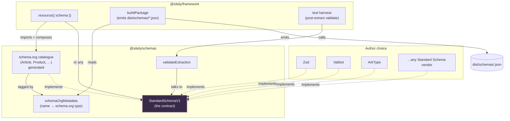

# @sitely/schemas

`@sitely/schemas` is the schema vocabulary. It defines the [Standard Schema](/overview/glossary#standard-schema) interface the [framework](./framework) speaks at its validation boundary, ships a generated catalogue of schema.org validators (`Article`, `Product`, `ItemList`, …) that site authors compose into their own [Resource](/overview/glossary#resource) schemas, and exposes the `validateExtraction` helper that the [test-pkg subsystem](./framework-test-pkg) and the server runtime call after every [extract](/overview/glossary#extract).

The catalogue is **generated** from schema.org's published vocabulary (the RDF / JSON-LD release at <https://schema.org/version/latest/>). It is not hand-authored — running the codegen against a new schema.org release produces an updated catalogue without anyone re-typing field lists. The codegen output is committed so consumers don't run the generator themselves; bumping schema.org's targeted version is one PR with a regenerated `schemas.ts`.

The package's deliberate non-job is *parsing*. It doesn't ship its own validator engine. It carries generated shapes, a tag for each shape, and a thin interop boundary.

## Schemas, Resources, and runtime validation

A site definition's `schemas` block maps schema names to Standard Schema validators. Each [Resource](/overview/glossary#resource) declared in the site definition references one of those names. The shape a Resource produces is the *output type* of the named schema.

The schemas in `@sitely/schemas` are *base* schemas — schema.org's `Article`, `Product`, `ItemList`, etc., with their schema.org fields. A site author rarely uses them as-is. The typical pattern is:

```ts
import { defineSite, urlPattern, TTL } from "@sitely/framework";
import { Article } from "@sitely/schemas";
import { z } from "zod";

const wikipediaArticle = z.object({
    ...Article.shape,                   // every schema.org Article field
    "@type": z.literal("Article"),
    pageId: z.number(),                  // Wikipedia-specific
    revisionId: z.number(),
    categories: z.array(z.string()),
});

const articleUrl = urlPattern("https://en.wikipedia.org/wiki/:title");

export default defineSite({...})
    .resource("article", {
        schema: wikipediaArticle,        // direct schema reference, no separate schemas block
        url: articleUrl,
        ttl: TTL.daily,
    })
    .page(articleUrl, { /* ... */ })
    .build();
```

The site's `wikipediaArticle` schema **implements** schema.org `Article` (carries every Article field and the `@type` discriminator) and **extends** it (adds Wikipedia-specific fields). Consumers can treat the Resource as plain `Article` if they only need the schema.org subset; consumers who want the extras read the wider shape. See [Resource](/overview/glossary#resource) in the glossary for the broader point.

Runtime validation is mandatory. The validator runs:

- During `sitely test`, against every [fixture](/overview/glossary#fixture)'s `expected.json` (the `schema-conformance` check).
- During `sitely check` (the static lane), against the *pattern* of each page's URLPattern — no fetch happens. Catches obviously-malformed declarations before publish.
- During `sitely check --live` (opt-in), against the *live* extraction result — fetched, run through `checkResponse + validate(ctx) + extract(ctx)`, validated. Authors run this before publishing to catch drift between the schema and the actual site; CI doesn't run it by default because it depends on the upstream site's availability.
- In the server runtime, against every fresh extraction before persisting it to the cache. No flag — bad data never enters the cache.

A schema that compiles but rejects perfectly valid live data is a bug. The author either loosens the schema (often by adding a [`presence()`](/overview/glossary#presence-annotation) annotation on the affected field) or fixes the extractor. There is no escape hatch — the schema is the contract.

## Presence annotation

Every field marked `.optional()`, `.nullable()`, or `.nullish()` must be wrapped in `presence(schema, rate)` declaring how often the field is expected to be present:

```ts
import { presence } from "@sitely/framework";

const Article = z.object({
    headline: z.string(),                                  // required (implicit presence 1.0)
    author:   presence(z.string().nullable(), 0.9),        // present ~90% of the time
    abstract: presence(z.string().nullable(), 0.3),        // present ~30% of the time
});
```

**Mandatory for optional/nullable.** `sitely build` fails if any `.optional()` / `.nullable()` / `.nullish()` field lacks a `presence()` wrapper. The point: every author has to commit to "how often is this present?" rather than silently shipping a field that's always absent and never noticed.

**At build time.** The framework emits the rate as a JSON Schema annotation (`x-sitely-presence: 0.9`). The JSON Schema validator ignores the annotation; downstream tools that care can read it.

**At runtime.** When telemetry is enabled (see [drift detection](/future/)), the server samples extractions per resource and per field, tracks observed presence rates over a rolling window, and alerts when the observed rate diverges from the declared rate beyond a tolerance. This catches the silent-regression case: the selector broke, the field went from "present 90% of the time" to "absent every time", and the schema still passes because the field is nullable.

**Test-time use.** Independent of presence, the `fixture-coverage` warning fires when a package's fixtures don't cover both present and absent for every `.optional()` / `.nullable()` / `.nullish()` field. Combined with mandatory presence annotation, the two close the loophole: authors commit a number, and the fixtures actually exercise both branches.

## Assets

URL-typed fields pointing at binary or plaintext files (images, video, audio, PDFs) use the `asset(type)` brand:

```ts
import { asset } from "@sitely/framework";

const InstagramPost = z.object({
    caption: z.string(),
    images: z.array(asset("image")),               // array of images, named by field
    authorAvatar: asset("image"),                   // single image, named by field
    attachedPdf: presence(asset("document"), 0.1),  // rarely-present document
});
```

`asset(type)` is a Standard Schema validator that accepts a URL string with the asset-type brand attached as metadata. Wire format stays a string URL; the brand is metadata the runtime introspects via [`getAssetMetadata`](/architecture/framework). Tooling can answer "what assets does this resource expose?" without re-parsing the schema.

Asset types supported today: `"image"`, `"video"`, `"audio"`, `"document"`. The list can extend without breaking existing usage — adding a type is non-breaking.

Why a brand and not a separate `assets` sibling on the extract output: the brand keeps the data in its semantic location (`post.authorAvatar` rather than `post.avatarUrl` + a separate lookup). The wire format is unchanged from the consumer's perspective; the brand is implementation detail.

## Why Standard Schema

There are three or four good validation libraries in the TypeScript ecosystem (Zod, Valibot, ArkType, Effect Schema, …) and they all do roughly the same job with different ergonomics. Picking one as "the sitely validator" would either:

- Force every author onto that choice regardless of preference, or
- Mean the framework grows N adapters, one per library, each with its own quirks.

Both are bad. [Standard Schema](https://standardschema.dev) is the ecosystem's answer: a tiny common interface (`StandardSchemaV1`) that every major validator implements. A consumer that speaks Standard Schema accepts any validator, from any library, without ever importing it.

The framework speaks only Standard Schema. The catalogue this package ships is emitted in Zod — because a single library had to be picked for the generator's output — but that's an implementation detail of `@sitely/schemas`, not a contract. An author who wants to declare their site's schemas in Valibot can do so: as long as the result is a Standard Schema, the framework accepts it. They can also import Zod schemas from this package, spread their fields into a Zod object of their own, and add site-specific fields; mixing libraries within one site definition is allowed.

[Schema.org](https://schema.org) plays a related but different role. It's the **interop target**, not the source of truth. The catalogue's validators are *generated from schema.org* so that downstream consumers (a directory that shows "which sites provide `Article`?", type generators that emit TS interfaces, drift detection) can reason about extractions in a single shared vocabulary. Authors aren't restricted to it — a [resource](/overview/glossary#resource)'s schema can extend a schema.org base, replace it entirely, or carry no schema.org fields at all. The validator engine is pluggable; the interop vocabulary is available when you want it.



## The `StandardSchemaV1` interface

This package mirrors the upstream Standard Schema spec rather than depending on `@standard-schema/spec` as a runtime package. The reason is dependency footprint — the spec is a single TypeScript file, and a frozen mirror lets `@sitely/schemas` stay zero-runtime-dep beyond Zod itself.

```ts
export interface StandardSchemaV1<Input = unknown, Output = Input> {
    readonly "~standard": StandardSchemaV1.Props<Input, Output>;
}

export namespace StandardSchemaV1 {
    export interface Props<Input = unknown, Output = Input> {
        readonly version: 1;
        readonly vendor: string;
        readonly validate: (
            value: unknown,
        ) => Result<Output> | Promise<Result<Output>>;
        readonly types?: Types<Input, Output> | undefined;
    }

    export type Result<Output> = SuccessResult<Output> | FailureResult;

    export interface SuccessResult<Output> {
        readonly value: Output;
        readonly issues?: undefined;
    }

    export interface FailureResult {
        readonly issues: ReadonlyArray<Issue>;
    }

    export interface Issue {
        readonly message: string;
        readonly path?: ReadonlyArray<PropertyKey | PathSegment> | undefined;
    }
}
```

What this gives the framework, in practice:

- **A single call shape.** `schema["~standard"].validate(value)` returns either `{ value }` or `{ issues }`. No library-specific `safeParse` vs `parse` vs `is` vs `assert`.
- **A version tag.** `version: 1` lets future framework versions detect — and refuse — schemas built against a newer spec.
- **A vendor string.** `vendor: "zod"` (or `"valibot"`, etc.) for diagnostics. Errors can attribute themselves: "validation failed (vendor: zod): …".
- **Type inference.** `InferOutput<Schema>` lets the framework derive the static type a schema produces without knowing which library authored it.

Keep this file in sync with the upstream spec at <https://standardschema.dev>.

## The catalogue

`schemas.ts` exports the generated catalogue of validators for schema.org's published vocabulary. Each one is a Zod `looseObject` (extra fields allowed — schema.org evolves; valid extractions shouldn't fail because the spec gained a field that hasn't been modelled yet) and implements Standard Schema through Zod's built-in `~standard` property.

The file is **emitted by the codegen step** (`pnpm schemas:generate`) from schema.org's RDF source. The generator reads the targeted schema.org version, walks the type hierarchy, and emits one Zod schema per type along with the `schemaOrgMetadata` map. Hand-editing `schemas.ts` between regenerations is allowed for narrow fixes (e.g. a known-bad schema.org field type) but those edits are documented inline so they survive the next regeneration.

The schemas shipped today:

| Export | schema.org type |
|---|---|
| `Thing` | `Thing` (base — every other schema spreads its fields) |
| `ImageObject` | `ImageObject` |
| `Person` | `Person` |
| `Organization` | `Organization` |
| `Article` | `Article` |
| `WebPage` | `WebPage` |
| `VideoObject` | `VideoObject` |
| `Product` | `Product` |
| `Recipe` | `Recipe` |
| `Review` | `Review` |
| `Rating` | `Rating` |
| `AggregateRating` | `AggregateRating` |
| `ListItem` | `ListItem` |
| `ItemList` | `ItemList` |

`schemaOrgVersion` pins the targeted schema.org vocabulary version (`"27.0"` at time of writing). The version is part of the [manifest](/overview/glossary#manifest)'s per-schema metadata.

A few intentional choices baked into the codegen:

- **`looseObject` everywhere.** Strict validation would reject extractions that capture schema.org fields that haven't been enumerated yet. Looseness is the correct default for a wire format whose source-of-truth (schema.org) is owned by someone else. Site authors who want strict validation tighten their own schema when they spread the base.
- **Composition by spread, not extension.** `Article` is emitted as `z.looseObject({ ...thingFields, headline, author, … })`, not `Thing.extend({ … })`. Spreading keeps each generated schema readable as a single object literal — the type signature *is* the documentation — and lets site authors do the same thing (`{ ...Article.shape, pageId: ... }`) when extending.
- **Union types for "string or object" fields.** Real schema.org payloads in the wild use `"author": "Jane Doe"` and `"author": { "@type": "Person", "name": "Jane Doe" }` interchangeably. The catalogue accepts both.
- **No enums.** Fields like `availability` (`"InStock"`, `"OutOfStock"`, …) are typed as `string`. Constraining them would reject perfectly valid extractions whose underlying site uses a variant spelling, and the cost of leniency here is low because downstream consumers can match what they care about.

### `schemaOrgMetadata`

```ts
export const schemaOrgMetadata = {
    Thing: { schemaOrgType: "Thing" },
    Article: { schemaOrgType: "Article" },
    Product: { schemaOrgType: "Product" },
    // …
} as const satisfies Record<string, { schemaOrgType: string }>;
```

A static map from export name to schema.org type. The [build subsystem](./framework-build) uses this to populate each manifest schema's `schemaOrgType` field — *by reference identity, traced through `Article.shape` spreads*. A schema authored as `z.object({ ...Article.shape, ... })` carries the `Article` tag in its emitted JSON Schema; a hand-rolled schema not derived from the catalogue carries `schemaOrgType: null`.

## Edge cases

### A resource's schema isn't in the catalogue

This is allowed. A resource's `schema` can be any Standard Schema validator — including ones authored in Valibot or ArkType, or hand-rolled Zod objects that don't correspond to any schema.org type. The build emits the JSON Schema for them, the test harness validates against them, and the manifest records `schemaOrgType: null` for those entries.

What changes for a non-catalogue schema:

- **`schemaOrgType` is `null` in the manifest.** Downstream consumers that index by schema.org type don't see it.
- **The directory groups it under "custom".** Sites can opt out of the schema.org vocabulary, but they pay an indexing cost.
- **Type inference still works.** Standard Schema's `InferOutput` doesn't care about schema.org; only the metadata layer does.

### The schema rejects valid data at runtime

If `validateExtraction` returns `success: false` on data the author considers correct, the schema is too strict. The fix is in the schema, not in the data — the test harness's `schema-conformance` check is the gate that catches this in CI. A schema that rejects its own fixture's `expected.json` fails `schema-conformance` and the package can't be marked [verified](/overview/glossary#verified).

The validator framework cannot tell "too strict" from "data is wrong"; the test author has to look at the failure message. The `errors` array in `ValidationResult` carries the path and message of every issue.

### The emitted JSON Schema and the runtime validator drift apart

The build emits a JSON Schema sidecar from the runtime validator (Zod → JSON Schema for catalogue entries; vendor-aware converter for non-Zod). If the converter has a bug, or if the runtime validator and the JSON Schema disagree on a corner case, the package would publish two contradictory shapes — and downstream tools picking different ones would see different results.

The `schema-emission-roundtrip` check ([§5.2 #4](./framework-test-pkg#the-eight-checks)) catches this. It validates every fixture's extracted output against the *emitted JSON Schema* (not the in-process validator). If the runtime accepts data the JSON Schema rejects, the check fails and the package can't ship.

### Non-Zod validators

Only Zod is supported for JSON Schema emission today. A package whose `defineSite({ schemas })` contains a Valibot, ArkType, or other non-Zod validator fails `sitely build` with a clear error: "no JSON Schema emitter for vendor `<name>` — use Zod or supply a custom converter". The runtime validator still works (the framework only speaks Standard Schema); the build refuses because the JSON Schema sidecar would be missing. Future revisions will dispatch on `~standard.vendor` and provide per-vendor adapters; until then, authors who need a non-Zod runtime validator can still spread `Article.shape` from `@sitely/schemas` into a Zod object so the export shape stays emittable.

### An async validator

Standard Schema permits `validate` to return a promise. `validateExtraction` rejects async validators with an explicit error — extract is on the hot path of the server runtime, and forcing the whole pipeline async for a feature no site actually needs would slow every cache miss. Authors who reach for an async validator get a clear "sync validators only" error pointing them at the supported surface.

## Validation: `validateExtraction`

```ts
export interface ValidationResult {
    success: boolean;
    data?: unknown;
    errors?: string[];
}

export function validateExtraction(
    schema: StandardSchemaV1,
    data: unknown,
): ValidationResult;
```

This is the boundary the framework calls between an extract function returning a payload and the framework persisting it (in tests: comparing against a snapshot; in production: writing to cache). Three behavioural notes:

1. **Array inputs are validated element-wise.** Some sites extract a flat list (`Article[]`) rather than a wrapped container (`{ items: Article[] }`). `validateExtraction` accepts either and applies the schema per element when given an array.
2. **Sync-only.** Standard Schema permits `validate` to return a promise; `validateExtraction` rejects async validators with a clear error.
3. **Errors are flattened strings.** Standard Schema's `Issue[]` is rich (message + path), but the framework's consumers (the test harness, the snapshot diff renderer) want printable lines. `validateExtraction` flattens issues into `["path.to.field: message", …]` form.

## Build-time JSON Schema emission

During `sitely build`, every schema declared in `defineSite({ schemas })` is emitted as a sidecar JSON Schema file at `dist/schemas/<Name>.json`. The [manifest](./manifest)'s `schemas.<Name>.$ref` points at this file.

The reason for sidecar files (rather than embedding JSON Schema in the manifest) is consumer ergonomics: a directory crawler that wants to display "show me the shape of `Article` for `wikipedia.org`" can fetch one small file rather than the entire manifest, and tooling that generates TypeScript types or OpenAPI documents from JSON Schema can point at the sidecar URL directly. The framework converts the runtime Standard Schema validator to JSON Schema at build time via a converter (Zod → JSON Schema for the catalogue; vendor-aware adapter for non-Zod author-supplied schemas).

This is also why downstream consumers don't need to know which validation library the author chose: the JSON Schema sidecar is the lingua franca. The Standard Schema validator is the *runtime* contract; the [JSON Schema](/overview/glossary#json-schema) sidecar is the *published* contract.

The full shape of the manifest's `schemas` block — `$ref`, `schemaOrgType`, `schemaOrgVersion` — lives in [The build manifest](./manifest#schemas-recordstring-manifestschema).

## Module-by-module

### `src/index.ts`

- **Responsibility:** declare the public surface — value re-exports for the catalogue, type re-exports for their inferred TS types, plus `validateExtraction` and `ValidationResult`.
- **Consumes:** nothing (re-export module).
- **Produces:** the per-schema value exports (`Article`, `Product`, `ItemList`, …) and their inferred type aliases (`ArticleType`, `ProductType`, …); `schemaOrgMetadata`, `schemaOrgVersion`; `validateExtraction`, `ValidationResult`.
- **Gotchas:** the Standard Schema interface itself is *not* re-exported from the package entry. Consumers that need the interface import it from `@sitely/schemas/standard-schema` (or, in practice, from `@sitely/framework` which re-exports it as part of its public typing surface).

### `src/schemas.ts`

- **Responsibility:** define the catalogue and the `schemaOrgMetadata` tag map.
- **Consumes:** `zod` (the underlying validator engine the catalogue is authored in).
- **Produces:** one Zod object per schema.org type the catalogue covers; the inferred TS type for each; `schemaOrgMetadata`; `schemaOrgVersion`.
- **Gotchas:**
  - Every schema is `z.looseObject(...)`, not `z.object(...)` — extractions with extra fields pass.
  - Composition is by spread (`...thingFields`), not `.extend()`. Adding a new field to `Thing` requires touching every schema that spreads `thingFields`; this is intentional — it makes the change reviewable.
  - The `schemaOrgMetadata` map is keyed by export name. Renaming an export without updating the map breaks the build step's tag lookup.

### `src/standard-schema.ts`

- **Responsibility:** mirror the upstream `StandardSchemaV1` interface and namespace so the framework can speak the spec without a runtime dependency on `@standard-schema/spec`.
- **Consumes:** nothing (pure type module).
- **Produces:** `StandardSchemaV1` interface; the nested `Props`, `Result`, `SuccessResult`, `FailureResult`, `Issue`, `PathSegment`, `Types` types; the `InferInput` and `InferOutput` helpers.
- **Gotchas:** this is a mirror. If the upstream spec at <https://standardschema.dev> changes, this file has to be updated to match. Treat divergence between this file and upstream as a bug.

### `src/validation.ts`

- **Responsibility:** the framework's validation boundary — given a Standard Schema validator and an unknown payload, return a normalised `ValidationResult`.
- **Consumes:** a `StandardSchemaV1` validator from any vendor; the raw output of a site's `extract(...)`.
- **Produces:** `ValidationResult` (`{ success, data?, errors? }`).
- **Gotchas:**
  - Sync-only. Async validators are rejected with an explicit error rather than awaited.
  - Array inputs are validated element-wise — a top-level array fails validation only if at least one element fails.
  - Errors are flattened to printable strings; callers that need structured issues should call the schema's `~standard.validate` directly.

## Read next

- [The build manifest](./manifest) — how the schemas declared in a site definition show up in `manifest.schemas` and `dist/schemas/*.json`.
- [@sitely/framework](./framework) — how `defineSite({ schemas })` wires the catalogue into a site package and how `validateExtraction` slots into the extraction pipeline.
- [Glossary: Standard Schema](/overview/glossary#standard-schema) — one-line definition with cross-links.
