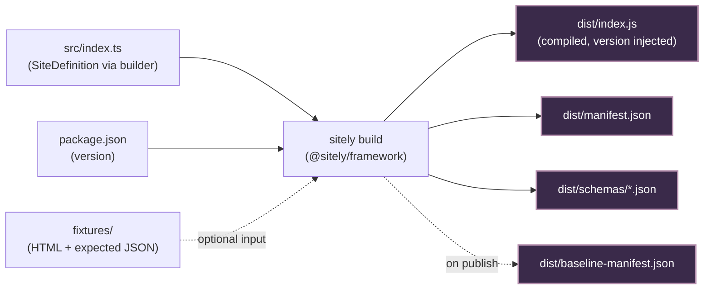

# Site packages

A [site package](/overview/glossary#site-package) is the unit of work in sitely: **one npm package per website**. Each package ships a declarative `src/index.ts` written against the [`@sitely/framework`](./framework) DSL, a `fixtures/` directory of captured HTML, the compiled `dist/index.js` produced by `sitely build`, and a test suite that runs the same eight checks every other package has to pass.

If `@sitely/framework` is the contract, a site package is the implementation. Everything else — the build pipeline, the test runner, the server's site-loader, the directory — exists to consume site packages.

## What's in a package

```
packages/<author>-site-foo/
├── package.json
├── src/
│   ├── index.ts            # defineSite(...).resource(...).page(...).build()
│   └── pages/
│       └── ...             # optional segments
├── fixtures/
│   └── article/
│       ├── <hash>.html
│       ├── <hash>.expected.json
│       └── <hash>.meta.json
├── dist/                   # emitted by `sitely build` — checked in
│   ├── index.js            # compiled site, version injected from package.json
│   ├── manifest.json
│   ├── baseline-manifest.json
│   └── schemas/
│       └── Article.json
├── *.test.ts               # uses @sitely/framework/testing
└── README.md
```

Two things to notice about the layout:

1. **`dist/` is checked in.** The compiled site, the manifest, and the schemas all live in git so reviewers, the directory, and any tooling that wants to read them can do so without running the build. The `manifest-integrity` check regenerates the manifest in CI and asserts byte-equality against the committed copy. Drift fails the build.
2. **[Fixtures](/overview/glossary#fixture) are the package's regression corpus.** Every test the package runs operates on fixtures, not live HTTP. New fixtures are captured with `sitely snapshot --page <key> '<params>'`; the resulting HTML + meta is committed alongside the code.

## Two ways to publish

The package name distinguishes the two paths:

| Naming | Path | Curation |
|---|---|---|
| `@sitely/site-<name>` | sitely-curated | Maintained by the sitely maintainers. Not a PR queue for outsiders; adoption into this namespace is a separate, maintainer-initiated motion. |
| `<author>-site-<name>` | Community | Publish-first. The author writes the package, runs `sitely test` locally, and `npm publish`es from their own repo. No PR queue, no permission ask, no blocked-on-a-human failure mode at publication. |

Both paths produce the *same artifact shape* — a built `dist/index.js` plus manifest plus fixtures plus tests. The directory shows them side-by-side, distinguished by namespace. The community path is the default; the sitely-curated path is the curated exception.

## A walkthrough

The shortest possible package is a single-origin, single-resource site:

```ts
// src/index.ts
import { defineSite, urlPattern, TTL } from "@sitely/framework";
import { Article, ItemList } from "@sitely/schemas";
import pkg from "../package.json" with { type: "json" };

const itemUrl = urlPattern("https://news.ycombinator.com/item/:id");
const frontPageUrl = urlPattern("https://news.ycombinator.com/news");

export default defineSite({
        site: { id: "hackernews", displayName: "Hacker News", version: pkg.version },
        origins: [{ hostname: "news.ycombinator.com" }],
        rateLimit: { maxConcurrent: 2, requestsPerSecond: 1/2 },
    })
    .resource("story", {
        schema: Article,
        url: itemUrl,
        ttl: TTL.medium,
    })
    .resource("frontPage", {
        schema: ItemList,
        url: frontPageUrl,
        ttl: TTL.short,
    })
    .page(itemUrl, {
        validate: (ctx) => ctx.$("td.title").exists(),
        extract: async (ctx) => ({
            story: {
                "@type":   () => "Article" as const,
                headline:  () => ctx.$("td.title a").text(),
                articleBody: () => ctx.$("td.title").text(),
                datePublished: () => ctx.$("span.age").attr("title") ?? "",
            },
        }),
        fixtures: [{ params: { id: "1" } }],
    })
    .page(frontPageUrl, {
        validate: (ctx) => ctx.$("table.itemlist").exists(),
        paginate: { next: (ctx) => ctx.$("a.morelink").attr("href") ?? null },
        extract: async (ctx) => ({
            frontPage: {
                "@type":   () => "ItemList" as const,
                itemListElement: () => ctx.$$("tr.athing").map((row) => ({
                    name: row.find("td.title a").text(),
                    url:  row.find("td.title a").attr("href"),
                })),
            },
        }),
        fixtures: [{ params: {} }],
    })
    .build();
```

Field-by-field:

- **`site`** is the package's identity. `id: "hackernews"` is the namespace prefix used everywhere — cache keys, resource identifiers (`hackernews:story`), directory URLs. `displayName` is what humans see. `version` is imported from `package.json`.
- **`origins`** is a single hostname here. The server uses this list to dispatch incoming URLs.
- **`rateLimit`** says: at most 2 concurrent requests, one every two seconds. The fraction form (`1/2`) reads as "one request every two seconds".
- **`.resource("story", ...)` + `.resource("frontPage", ...)`** declare two typed outputs. Each has its own schema, URLPattern, and TTL.
- **`.page(itemUrl, ...)` + `.page(frontPageUrl, ...)`** declare the two URL patterns where extraction happens. The page's URLPattern is also its identifier in the manifest.
- **`paginate.next`** on the front page returns the URL of the "more" link or `null` when exhausted.
- **`fixtures`** inline declarations — params typed against the page's URLPattern. The framework derives the on-disk hash from the params.

A slightly more interesting case — a multi-locale site:

```ts
// src/index.ts
import { defineSite, urlPattern, presence, asset, TTL } from "@sitely/framework";
import { Article } from "@sitely/schemas";
import { z } from "zod";
import pkg from "../package.json" with { type: "json" };

const articleUrl = urlPattern("https://{locale}.wikipedia.org/wiki/:title");

const WikipediaArticle = z.object({
    ...Article.shape,
    "@type": z.literal("Article"),
    pageId: z.number(),
    revisionId: z.number(),
    categories: z.array(z.string()),
    leadImage: presence(asset("image"), 0.6),
});

export default defineSite({
        site: { id: "wikipedia", displayName: "Wikipedia", version: pkg.version, homepage: "https://www.wikipedia.org/" },
        origins: [{ hostname: "{locale}.wikipedia.org", templated: true }],
        rateLimit: { maxConcurrent: 3, requestsPerSecond: 1 },
        locales: { source: "host", values: ["en", "de", "fr"], default: "en" },
        normalizeUrl: (url) => url.replace(/\?.*$/, ""),         // strip query string
        framework: { minVersion: "0.1.0", maxVersion: "1.0.0" },
    })
    .resource("article", {
        schema: WikipediaArticle,
        url: articleUrl,
        ttl: TTL.daily,
    })
    .page(articleUrl, {
        validate: (ctx) => ctx.$("#firstHeading").exists(),
        extract: async (ctx) => ({
            article: {
                "@type":     () => "Article" as const,
                headline:    () => ctx.$("#firstHeading").text(),
                articleBody: () => ctx.$("#mw-content-text .mw-parser-output").text(),
                pageId:      () => Number(ctx.$('[name="wgArticleId"]').attr("content")),
                revisionId:  () => Number(ctx.$('[name="wgCurRevisionId"]').attr("content")),
                categories:  () => ctx.$$("#catlinks .mw-normal-catlinks li").map((li) => li.text()),
                leadImage:   () => ctx.$(".infobox img").attr("src"),
            },
        }),
        fixtures: [
            { params: { locale: "en", title: "TypeScript" } },
            { params: { locale: "de", title: "TypeScript" } },     // satisfies locale-matrix
            { params: { locale: "en", title: "Nonexistent_Page" }, errorCase: true },
        ],
    })
    .build();
```

What changes vs the Hacker News example:

- **One templated origin** (`{locale}.wikipedia.org`) plus a `locales` block produces three concrete hostnames at use-time. The manifest carries the expanded list.
- **`locales.source: "host"`** — the [locale](/overview/glossary#locale) lives in the subdomain. With `source: "path"`, the URL pattern would carry it (`/:locale/wiki/:title`); with `source: "query"`, the locale comes from a query parameter. The cache key always includes locale regardless of source.
- **`normalizeUrl`** strips query strings — Wikipedia carries lots of variants (`?action=raw`, `?oldid=...`) that should collapse to one cache entry.
- **`framework`** pins compatible framework versions. The server's site-loader refuses to load this package under a framework version outside `[0.1.0, 1.0.0]`.
- **`presence(asset("image"), 0.6)`** declares the lead image is present ~60% of the time — drift telemetry alerts if the observed rate diverges.
- **Fixtures cover two locales** to satisfy the `locale-matrix` check, plus one `errorCase: true` for the error-path check.

## Fixtures and their conventions

A fixture is a captured HTTP response paired with its expected extraction. On-disk layout (per-page directory, per-params hash):

```
fixtures/
└── <page-key>/
    ├── <hash>.html          # captured HTML body
    ├── <hash>.expected.json # what extract(ctx) should produce
    └── <hash>.meta.json     # url, status, headers, fetchedAt
```

`<page-key>` is derived from the page's URL pattern (e.g. `article` for `/article/:id`). `<hash>` is a short stable hash of the fixture's `params`.

Fixtures are committed to git. The deterministic test runner loads `<hash>.html`, wraps it with a `CheerioDriver`, builds an `ExtractContext` (with `meta.json` filling `url` / `status` / `headers`), and runs `validate(ctx)` + `extract(ctx)` **in-process**. The default `ctx.fetch` throws — if an extractor reaches for the network during a test, the test fails loudly.

Why this matters: every check on every PR operates on the same bytes a reviewer can read. There is no "works on my machine" axis. Reproducibility comes from fixtures being the input, not the input being a snapshot of whatever the site happened to serve when CI last ran.

New fixtures are captured with `sitely snapshot --page <key> '<params>'`. The CLI ignores robots.txt on this path — author-initiated actions, not server-side traffic.

## The build output



Running `sitely build` in a package directory produces four artifacts:

- **`dist/index.js`** — the compiled site definition with `version` injected from `package.json`. Server + client both import this.
- **`dist/manifest.json`** — the [manifest](/overview/glossary#manifest). Site identity, origin list, resources, pages, schemas, framework version, source commit.
- **`dist/schemas/<Name>.json`** — one JSON Schema per schema referenced from a resource.
- **`dist/baseline-manifest.json`** — the previous release's manifest, rotated forward at `sitely build --publish` time. Used by [`semver-discipline`](/guide/testing#semver-discipline).

Determinism is a build rule: regenerating from the same source must produce byte-identical output. `build.commit` and `build.builtAt` are pinned to the package's last source-touching commit, never wall clock. Field order is lexicographic.

## Multi-locale sites

A few rules that fall out of *"one identity, many origins"*:

- **One package per site, never per language.** `packages/site-wikipedia` covers `en.wikipedia.org`, `de.wikipedia.org`, and `fr.wikipedia.org` from one package. The directory shows one entry, not three.
- **`origins` is derived from `locales`** when the locale lives in the host. The site definition declares a templated origin (`{locale}.wikipedia.org`); `getActiveOrigins()` expands it against `locales.values` at use-time.
- **Robots.txt is per-origin.** Locale-in-host sites have N robots.txt files; the server's robots cache fetches each one separately. Locale-in-path sites have one robots.txt that covers every locale.
- **Fixtures must cover at least two declared locales.** The `locale-matrix` check fails if a multi-locale package ships fixtures for only one locale. Single-locale declarations skip the check entirely.

## Site families

A [family](/overview/glossary#family) is an opt-in case where one package covers multiple origins that share **literal HTML structural identity** — every Stack Exchange site, for example. The criterion isn't "looks similar"; it's "the selectors that work for one work for all, byte-for-byte, every page type."

Family packages declare a `family` block in the site header:

```ts
defineSite({
    site: { id: "stackexchange", displayName: "Stack Exchange", version: pkg.version },
    origins: [{ hostname: "*.stackexchange.com", templated: true }],
    family: {
        origins: [
            { hostname: "stackoverflow.com", display: "Stack Overflow" },
            { hostname: "serverfault.com", display: "Server Fault" },
            { hostname: "superuser.com", display: "Super User" },
        ],
        structuralIdentityCheck: "stackexchange",
    },
    rateLimit: { maxConcurrent: 2, requestsPerSecond: 1 },
})
```

The `structuralIdentityCheck` identifier names a check that asserts the origins do, in fact, share literal HTML identity — typically a fixture set drawn from a representative subset of family members. The check failing means the family has drifted apart and the package needs to split into per-origin packages.

Per-origin [verified](/overview/glossary#verified) state is preserved across the family — one origin getting flagged as [drift suspected](/overview/glossary#drift-suspected) doesn't taint the whole family, just that origin.

**Per-origin packaging is the default.** Family eligibility is bounded, requires the structural-identity check to pass, and is the exception. Reach for a family package when the cost of N near-identical packages exceeds the cost of carrying the family-check machinery; default to per-origin otherwise.

## What the test suite enforces

Every package must pass the same eight checks before it's considered shippable. The full list and exact failure semantics live in [The test suite](/guide/testing). At a glance:

1. **`fixture-extraction`** — every fixture's `validate` + `extract` succeeds and the result matches `<hash>.expected.json`.
2. **`schema-conformance`** — every extracted result validates against its declared schema.
3. **`determinism`** — re-running extraction on the same fixture twice yields byte-identical output.
4. **`schema-emission-roundtrip`** — extracted output validates against the JSON Schema emitted to `dist/schemas/<Name>.json`.
5. **`locale-matrix`** — multi-locale sites have fixtures for at least two declared locales (skipped for single-locale).
6. **`error-path-coverage`** — at least one `errorCase: true` fixture exists and `validate` returns `false` for it.
7. **`manifest-integrity`** — regenerating the manifest from source produces byte-identical output.
8. **`semver-discipline`** — manifest diff against `dist/baseline-manifest.json` matches the version bump in `package.json`.

Plus warning-only checks: `fixture-freshness`, `performance-budget`, `ttl-plausibility`, `fixture-coverage`. None block shipping.

These eight are the entire automated bar for "this package is shippable." There is no ninth must-pass check hiding in a reviewer's head.

## Edge cases and failure modes

The boundaries the site-package contract pins down.

### Build failures

- **`src/index.ts` has no default export.** Build fails: `expected a default export from defineSite(...).build()`.
- **A resource's `schema` is not a Standard Schema.** Build fails with the resource name.
- **A resource declares both `url` and `derivedFrom`.** Build fails — they're mutually exclusive.
- **A resource declares `derivedFrom: "X"` where `X` isn't a registered resource.** Compile error at the builder step; build never starts.
- **A `resources.<name>.ttl` triple has `min > max`.** Build fails with the resource name and values.
- **A page's `extract` returns a key that isn't a registered resource.** Compile error at the builder step.
- **`origins` is empty.** Build fails — a site definition must claim at least one hostname.
- **A `locales.value` doesn't appear in the template expansion.** Build fails with the offending locale.
- **A schema has `.optional()` / `.nullable()` / `.nullish()` without a `presence()` wrapper.** Build fails with the field path.

### Page matching at runtime

- **Two pages match the same URL.** First declaration wins. Authors who don't want one pattern to over-match another should narrow the pattern or use a `validate` predicate.
- **A page's `validate(ctx)` returns `false`.** The framework records the result and does not call `extract`. The server returns `status: "error"` with `error: { kind: "page_validation_failed" }` — there's no generic-extraction fallback. If the page can sometimes serve content that doesn't match the pattern (captcha, login wall), throw a [framework error](/overview/glossary#framework-errors) from `checkResponse` so the consumer gets a more specific status.
- **A page's `extract(ctx)` throws an [`ExtractionError`](/overview/glossary#framework-errors).** The framework records the error; the orchestrator returns `status: "error"` (or `stale` if a stale row exists). The error includes the URL and the page key.
- **A field function throws.** Caught per-field. The framework records the error against that field path; other fields continue extracting. Schema validation downstream decides whether absence is permitted.
- **`paginate.next(ctx)` returns a URL outside the site's origins.** The framework refuses to follow it; the walk stops, partial result returned with `hasMore: true, cursor: null`.

### Fixtures

- **A fixture's `<hash>.expected.json` is missing for a non-error fixture.** `fixture-extraction` fails with the fixture name and the missing path.
- **`<hash>.expected.json` exists but the extracted data doesn't match.** `fixture-extraction` fails with a structural diff; the author updates either the extractor or the fixture.
- **`<hash>.html` has been edited but `<hash>.meta.json` wasn't.** The `fixture-freshness` warning catches inconsistency (doesn't block shipping).

### Locales

- **A locale value appears in an incoming URL but isn't in `locales.values`.** The fetch path treats it as a 404 — no page matches because the locale expansion doesn't cover that value.
- **A package declares `locales.values: ["en", "fr"]` but no fixtures cover French.** `locale-matrix` fails.

### Family declarations

- **Two origins in a family declare different rate limits.** Both are respected. Rate limits scope to origin by default; each origin in a family carries its own slot in the per-host token bucket.
- **An origin in a family fails the `structuralIdentityCheck`.** The check fails the build for the package as a whole. Either the family is split into per-origin packages, or the offending origin is removed from the family list.

### Hostname conflicts at load

- **Two installed packages claim the same hostname.** The server's site-loader logs a warning and keeps the first registration. The second package is otherwise silent for that hostname. If one of those packages also claims another hostname, that other hostname is still served by the second package.

## Read next

- **[@sitely/framework](./framework)** — the DSL and the runtime contract every site package implements.
- **[The build manifest](./manifest)** — the field-by-field shape of `dist/manifest.json`.
- **[Build subsystem](./framework-build)** — how the builder output becomes `dist/index.js` + manifest.
- **[Test-pkg subsystem](./framework-test-pkg)** — the in-process runner and the eight checks in operational detail.
- **[Glossary](/overview/glossary)** — terms used throughout these pages.
