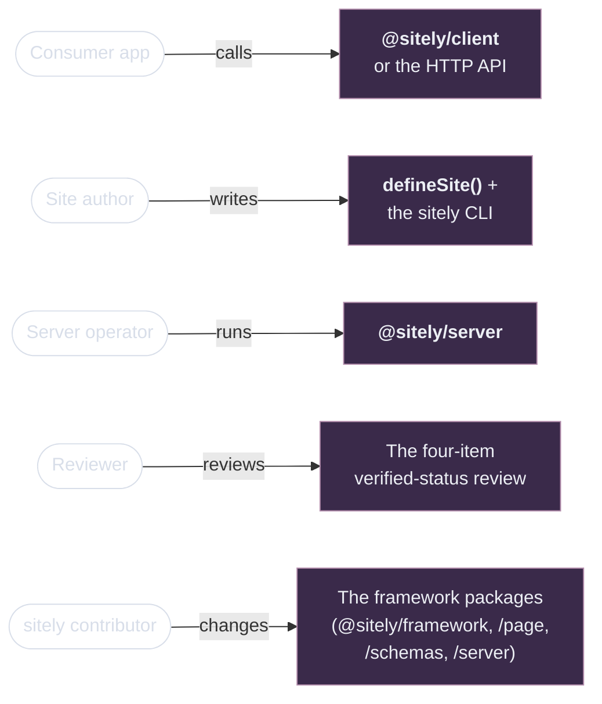

# What is sitely?

> **Design Preview.** sitely has no implementation yet. The documentation below describes the system as it is being designed — every contract is settled before any code is written. When you see "the server does X" or "the client returns Y", read that as "the architecture says X / Y will hold."

sitely turns any URL into structured JSON. You make one call — from the [TypeScript client](/guide/using-the-client), `curl`, or any HTTP library — and get back typed data. No selectors, no parsers, no upkeep when sites change layouts.

## Who this is for

Five roles, one diagram. Find yours.



Where each actor lands in the docs:

- **Consumer app** — you read an Article, Product, recipe, listing… from a site sitely already supports, and you'd rather not build a scraper. → [Using the TypeScript client](/guide/using-the-client) or [Consuming the HTTP API](/guide/consuming-the-api).
- **Site author** — you need data from a site sitely doesn't yet cover, and you're writing the extractor. → [Writing a site package](/guide/writing-a-site).
- **Server operator** — you're running `@sitely/server` on your own infrastructure. → [Self-hosting the server](/guide/self-hosting).
- **Reviewer** — you sign off on the three items automation can't check ([selector fragility, identity bucket, README sanity](/guide/testing#what-the-human-review-covers)). → [Publishing](/guide/publishing).
- **sitely contributor** — you want to understand or change the framework itself. → [Architecture overview](/architecture/).

The roles overlap — a consumer who self-hosts is also an operator; a site author is usually a consumer of their own package. Pick whichever role describes what you're trying to do *right now*.

Everyone shares the [Glossary](./glossary) — every term has one definition there.

## Your first call

```ts
import { createClient } from "@sitely/client";
import wikipedia from "@sitely/site-wikipedia";

const sitely = createClient({
    baseUrl: "https://sitely.example/api",
    apiKey: process.env.SITELY_API_KEY!,
    sites: [wikipedia],
});

const article = await sitely
    .site("en.wikipedia.org")
    .resource("article", { title: "TypeScript" });

console.log(article.data);
//   { "@type": "Article", headline: "TypeScript", articleBody: "...",
//     pageId: 14336, revisionId: 1234567, categories: [...] }
```

`article.data` is fully typed against the Wikipedia site package — schema.org `Article` fields plus Wikipedia's extensions. No casting, no runtime narrowing.

Or with `curl`, no client needed:

```bash
curl "https://sitely.example/api/v1/extract?url=https://en.wikipedia.org/wiki/TypeScript" \
    -H "Authorization: Bearer sitely_sk_..."
```

The HTTP API returns the same envelope (`status`, `data`, `cached`, `cost`, …) with `data` keyed by resource name: `{ "article": { ... } }`. The TypeScript client unwraps `data` to the named resource when the call is resource-driven — see [the two main ways to call](#the-two-main-ways-to-call) below for the contract. The HTTP API is the wire-shape source of truth; the client adds typing, retries, pagination, and cancellation.

## What sitely does for you as a consumer

- **Pre-built [site packages](./glossary#site-package).** Each one is an npm package that knows how to read a specific website. The server picks the right one from the URL's hostname.
- **Every response is typed.** sitely doesn't guess at unknown URLs — if you need data from a site nobody's written a package for yet, [write one](/guide/writing-a-site). The benefit: every shape is auditable, every field carries a schema, and you never get "something" back when you needed a guarantee.
- **Caching with sensible defaults.** Hot (Redis) and cold (Postgres) layers, with per-resource [TTL](./glossary#ttl). You can pass `fresh: true` to force a live re-fetch.
- **[Request coalescing](./glossary#coalesce).** Ten parallel calls to the same URL fan into one extraction at the server.
- **Rate limiting on your behalf.** sitely respects each target site's rate limit so you don't get your IP blocked.
- **robots.txt respected by default.** No flag overrides this on the server.

## The two main ways to call

### 1. By URL — when the site is one of yours

```ts
const page = await sitely.extract({ url: "https://en.wikipedia.org/wiki/TypeScript" });

//   page.data is the wire shape — always keyed by resource name:
//   { article: { "@type": "Article", headline: "TypeScript", ... } }
//   or, for a multi-resource page:
//   { category: { ... }, itemList: [ ... ] }
```

sitely matches the hostname against the [site packages](./glossary#site-package) you passed to `createClient`. If no installed package matches, the call returns `status: "no_matching_site"` — sitely doesn't guess. URL-driven calls don't name a resource, so the response is always the keyed wire shape; the consumer narrows on `result.site.domain` or by checking which key is present.

```ts
if (page.status === "success") {
    // page.data is the keyed shape: { article: Article } | { product: Product } | ...
    // depending on which installed site matched.
    if ("article" in page.data) {
        page.data.article.headline;  // typed against the matching site's article schema
    }
}
```

### 2. By site and resource — fully typed

```ts
const article = await sitely
    .site("en.wikipedia.org")
    .resource("article", { title: "TypeScript" });

//   article.data is the resource itself — unwrapped because you
//   named one resource. Typed against the resource's schema; no
//   narrowing needed when sites are passed to createClient.
```

Resource-driven calls *name* a resource, so the client unwraps to that resource's data directly. The client infers types from the site packages you pass to `createClient`. Domains, resource names, params, and return shapes all come from the site definitions directly. Best for code that integrates with one or more specific sites.

To ask for additional resources on a multi-resource page, use `include`:

```ts
const both = await sitely
    .site("en.wikipedia.org")
    .resource("article", { title: "TypeScript" }, { include: ["categories"] });

//   both.data is the keyed multi-resource shape:
//   { article: {...}, categories: [...] }
```

See [Using the TypeScript client](/guide/using-the-client) for the full surface — typed inference, discovery, pagination, errors.

## What sitely *isn't*

- Not a general-purpose scraping library. If you need imperative crawl-state code, sitely is the wrong tool.
- Not a content-moderation system. sitely extracts what websites publish; it doesn't judge content.
- Not a hosted product (yet). You run the server yourself — see [Self-hosting the server](/guide/self-hosting). Notes on a possible hosted version live in [Future direction](/future/).

## If you're adding a new site

If sitely doesn't have a package for the site you need, the [Writing a site package](/guide/writing-a-site) guide walks through authoring one. A site package is a single TypeScript file plus HTML fixtures — a few hundred lines for a typical site. Once published, anyone with a sitely server can install it and your data is one client call away.

## If you're contributing to sitely

The [Architecture overview](/architecture/) is the map. Each subsystem has a deep-dive page; the [glossary](./glossary) defines every term; [The manifest](/architecture/manifest) is the central shared artifact.

## Read next

- **You want to call sitely:** [Using the TypeScript client](/guide/using-the-client) or [Consuming the HTTP API](/guide/consuming-the-api).
- **You want to host sitely yourself:** [Self-hosting the server](/guide/self-hosting).
- **You want to add a new site:** [Writing a site package](/guide/writing-a-site).
- **You're confused by a term:** [Glossary](./glossary).
