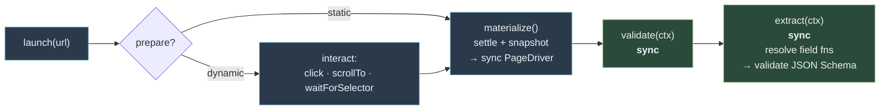
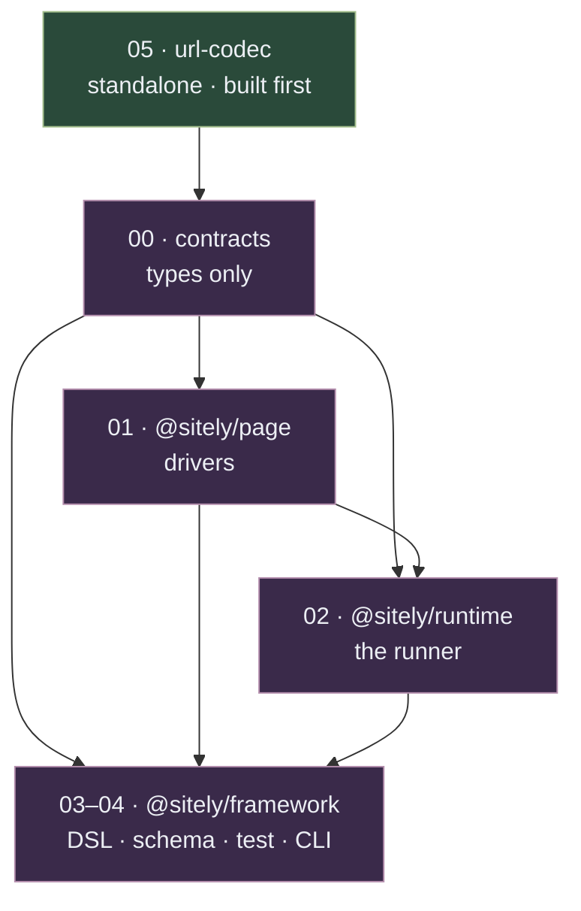

# Implementation plan

> **Design Preview.** No code exists yet. This plan is **v0-first**: a proof-of-concept scoped
> to the one hypothesis that must hold before anything else — that authoring a scraper is
> ergonomic, declarative, and type-safe over a *backend-neutral* DOM — then a v1 outline for the
> rest. Full-system conflict rulings from the earlier design live in
> `planning/REBUILD-DECISIONS.md`; the scope decisions behind *this* plan are in
> [Locked decisions](#locked-decisions).

## North-star goals

The project's durable goals. v0 proves **G1** and **G5** and keeps seams open for the rest;
everything else is v1+.

- **G1 · Ergonomic, maximally-declarative authoring.** The author states *what* to extract; the
  framework owns the piping.
- **G2 · Cross-site interop by common interface.** A consumer asks for a *resource by interface* —
  "give me an `Article`" — and gets it from every site that implements it. Base interfaces are
  **generated** (from schema.org) and **annotated** so the runtime can route interface requests.
- **G3 · Type-safe consumption.** Consumers get types with no hand-maintained duplication —
  leaning **GraphQL** (interface types = common resources; introspection supplies types).
- **G4 · Reliability platform.** Tooling that keeps scrapers correct over time: fixture
  management, live-check cron, optional-field-selector drift alerts, a scraper compliance suite.
- **G5 · Performance & backend neutrality.** Static HTML by default (cheap); **one sync DOM
  interface** spanning static (Cheerio/JSDOM) and dynamic (Playwright/CDP, with interaction), so
  moving a scraper between backends changes *no extraction code*.

## v0 — the proof of concept

**The hypothesis:** ergonomic, declarative, type-safe authoring over a backend-neutral DOM that
serves static *and* dynamic (interaction-gated) sites — in-process, **no server, no consumer**.

**Definition of done:** you author the three example scrapers below and a `sitely dev` /
`sitely test` loop gives schema-validated, typed extraction from committed fixtures, with
authoring mistakes (a field function whose return doesn't match its resource's schema, a `p.many` binding that returns a single object)
caught at **compile time**. The proof is the *feel* of authoring plus the *correctness* of the
output — across a clean static site and a brutal dynamic one.

### The extraction lifecycle

The load-bearing architecture: async setup, **sync extraction** — identical across every backend.

- **`launch(url)`** — static: fetch. dynamic: open a browser page (Playwright/CDP), navigate.
- **`prepare(page)`** — *optional, per-page, async, dynamic-only.* The author drives
  interaction-gated content into the DOM with `click` / `scrollTo` / `scrollToBottom` /
  `waitForSelector`. Absent for static sites. Expand the accordion; scroll the job description
  into view.
- **`materialize()`** — settle, then snapshot the now-complete DOM into a sync `PageDriver`.
- **`validate(ctx)` / `extract(ctx)`** — **sync**, against the snapshot. `extract` returns
  field-function objects; the runner resolves them and validates the result against the
  resource's JSON Schema.

**Fixtures capture the post-`prepare` DOM**, so interaction-gated sites still test statically and
deterministically — the interaction runs at *capture* time, not test time.

### Components & build order

| # | Spec | Package | Scope |
|---|---|---|---|
| 05 | [URL codec](./05-url-codec) | *(standalone)* | `URLCodec` — typed, reversible **path + query** patterns (`urlCodec`, `toUrl`/`fromUrl`, aliases, call-time `base`). **Built first** — spec file numbers are stable IDs, not build positions. |
| 00 | [Contracts](./00-contracts) | *(shared types)* | `SiteDefinition`, the read-surface + context interfaces (`PageElement`/`PageDriver`/`PageController`/`ExtractContext`), `Interface`, the re-exported `URLCodec`, `RunnerResult`, the JSON-Schema boundary, error taxonomy. |
| 01 | @sitely/page | `@sitely/page` | Implements the sync read surface (declared in 00) — Cheerio + Playwright/CDP drivers + the `prepare` interaction lifecycle (opt-in so static-only users skip Chromium). JSDOM-ready, deferred. |
| 02 | @sitely/runtime | `@sitely/runtime` | The runner: `launch → prepare → materialize → validate → extract → resolve field fns → validate schema`. Driver-injected; builds `ExtractContext`; owns `validateExtraction`. **Reused verbatim by the v1 server.** |
| 03 | Framework — DSL | `@sitely/framework` | `resource`, `page` (`p.one`/`p.many` builder, `render` discriminant), `defineSite`, `urlCodec` (re-exported from [05](./05-url-codec)), `defineInterface`, field functions, `presence`/`asset` helpers, authoring-side type-safety, minimal errors. |
| 04 | Framework — test/CLI | `@sitely/framework` | In-process test harness (the v0 checks) + the `sitely` CLI (`test` · `dev` · `snapshot`). |

### Schema foundation

**JSON Schema is the required schema definition** — the framework's boundary. Everything reads
JSON Schema: validation, annotations, and (v1) catalogue + GraphQL emission. No lossy conversion,
because JSON Schema *is* the canonical form.

- **Authoring:** **TypeBox** is the recommended tool — guides recommend it, example scrapers use
  it — because it produces JSON Schema *and* gives static TS types for free (`Static<typeof T>`).
  Any JSON-Schema-emitting tool works; **no library lock-in.** Standard Schema is an optional
  escape hatch, not the boundary.
- **Validation:** Ajv or TypeBox's compiler over the JSON Schema — a net catching "the selector
  returned the wrong shape," and (v1) the source of the drift signal.
- **Annotations = custom keywords:** `x-sitely-presence` (drift), `x-sitely-asset` (media),
  later `x-sitely-implements` (interface identity) and `x-sitely-ttl` (freshness). JSON Schema is
  purpose-built for this.
- **Asset = typed object,** not a bare string: `{ url, type, format?, mimeType? }` — `type` the media
  kind, `format` the transport (`hls`/`dash` = manifest, `progressive` = file; **video/audio only**),
  `mimeType` the content-type when the DOM exposes it. The `asset<K>(kind)` helper emits its closed
  schema + `x-sitely-asset`; self-describing on the wire.
- **Interfaces = named schema claims:** `Interface` (`{ kind, name, schema }`) reifies the G2 unit in
  v0 — `defineInterface` mints partial parse contracts consumed by `ctx.jsonLd`; the v1 catalogue is
  generated `Interface` values and `resource`'s v1 `implements` option takes the same type.
- **Presence is required on optional/nullable fields** — but as a `sitely test`/CI gate, not a
  run gate: `sitely dev` warns and `defineSite` never blocks. The annotation seeds G4's drift
  detection.

### In scope

- `@sitely/page`: the sync DOM interface + Cheerio and Playwright/CDP drivers + the `prepare`
  interaction API.
- `@sitely/runtime`: the driver-injected runner + `ExtractContext` (`$`/`$$`, `jsonLd` — raw and
  `Interface`-parsed, `params`, `url`/`status`/`headers`, `canonical`; the interface is declared in
  00, built here) + `validateExtraction`.
- `@sitely/framework`: the builder DSL, `urlCodec` (via the standalone codec, [05](./05-url-codec)),
  `defineInterface`, field functions with per-field error isolation, `presence`/`asset` helpers, the
  JSON-Schema validation boundary, authoring-side type-safety, a minimal error surface, the test
  harness, and the CLI (`test`, `dev`, `snapshot`).
- Three real example scrapers + their fixtures; hand-written unit fixtures; one controlled
  dynamic test page.

### Out of scope → v1

The entire server (`@sitely/server`, Postgres, Redis, cache, rate-limit, robots, auth, coalescing,
retry) · the client SDK + consumer type inference (GraphQL) · the common-interface system
(generated catalogue, `implements`, cross-site request-by-interface) · build/manifest/signing ·
pagination, locales/families, `checkResponse`, automatic captcha detection, retry disposition,
`normalizeUrl`, `ctx.fetch`, TTL · the JSDOM driver · the reliability
platform · target-site auth.

### Example scrapers

Real, hard, diverse — chosen to stress the system across different axes, **not** for convenience.
(A PoC must prove the design against *reality*; the fixture model already gives test determinism,
so controlled sandboxes buy nothing and hide the leaks real sites expose.)

| Site | Stresses | Driver | Notes |
|---|---|---|---|
| **Hacker News** | Multi-resource-per-page (`story` + `comments`), static list, query-addressed pages (`/item?id=…`) | Cheerio | Clean static baseline |
| **Reddit** | JS-render, scroll-to-load nested comments (`prepare`) | Playwright + `prepare` | Brutal dynamic |
| **LinkedIn** | JS-render, scroll-to-reveal job description (`prepare`), auth-walled + hostile | Playwright + `prepare` | Fixture captured from a logged-in session; framework auth is v1 |

The set is intentionally **dynamic-heavy**. LinkedIn's fixture is a manual authed snapshot —
extraction tests run against the committed HTML, so there's no auth at test time. An e-commerce
scraper (Product, accordions, variants) is a **v1** example.

### Test inputs

Three kinds; only the third is a design choice:

1. **Hand-written minimal fixtures** — tiny crafted HTML, unit-testing driver / `PageElement` /
   runner edge cases (empty element, absent attr, malformed, nesting).
2. **Real example-scraper fixtures** (above) — integration proof; run in CI off frozen HTML.
3. **One controlled dynamic test page** (accordion + scroll-load, served in CI) — the only way to
   test the live `launch → prepare → materialize` path deterministically (LinkedIn/Reddit can't
   run in CI), and it recovers *click-expand* coverage. Exercises both `prepare` sub-modes.

No general controlled-site corpus.

## v1 — outline

By priority stack:

- **G2 · Cross-site interop (marquee):** schema.org → **generated + annotated** JSON-Schema
  interface catalogue — a set of `Interface` values (the v0 type); resources declare implemented
  interfaces via `resource`'s `implements` option, which stamps `x-sitely-implements` with the
  interface *name* (names are the identity; the catalogue is authoritative for what a name means, so
  conformance is checked against the catalogue's canonical schema); consumers **request a resource by
  interface and get it from every site that provides it.**
- **G3 · Typed consumption:** the client — strong lean **GraphQL** (interface types = common
  resources; introspection supplies types, likely dissolving heavy consumer-side TS generics).
- **Runtime:** `@sitely/server` — reuses the v0 `@sitely/runtime`; loads packages, fetches/renders,
  caches, rate-limits, robots, the seven-status wire envelope.
- **Media delivery (the signed-URL problem):** many sites serve media — especially HLS/MPEG-DASH
  manifests + their segments — via **signed URLs bound to IP + expiry**, so an extracted `url` is
  useless to a remote consumer and dies within minutes. The answer is a **media relay over a
  centralised static egress**: all sitely outbound routes through one stable IP (a NAT / egress
  gateway), so any node can fetch IP-scoped assets; the relay proxies the asset — **rewriting HLS/DASH
  manifests** so segment requests route through it too — and **re-derives** expired signed URLs on
  demand. The extracted `url` is a *source reference*, not a durable link; the asset's `format` tag
  tells the relay which need manifest-rewriting.
- **Field/resource freshness (TTL):** an `x-sitely-ttl` schema annotation sets a coarse default
  freshness per field/resource, with a **per-value override** for values that carry their own expiry
  (a signed URL's `?Expires=`). It feeds the cache and, for ephemeral assets, the relay's
  re-derivation ("ephemeral: re-derive on access") — one story with the media-delivery work above.
- **G4 · Reliability platform:** live-check cron, optional-field-selector drift alerts, fixture
  tooling (possibly its own package), the compliance suite.
- **G5 continued:** JSDOM driver; production Playwright render path; per-selector CDP perf knob if
  snapshotting proves slow.
- **Distribution:** `sitely build`, deterministic manifest, JSON Schema sidecars,
  semver-discipline, signing.
- **Ergonomics:** an **HTML→Markdown prose helper** (over `.html()`) for prose fields
  (article/job-description body); an **e-commerce example scraper**.
- **Auth:** target-site sessions/credentials (LinkedIn-class) as a framework feature.

## Locked decisions

The scope decisions behind this plan (from the design interview):

- v0 = **authoring + extraction core**; no server, no consumer.
- **Sync DOM read surface**; the backend is chosen at *render* time (static fetch vs
  Playwright/CDP render), so extraction code is backend-identical.
- **Lifecycle:** async `launch` → optional async per-page `prepare` (interaction) → `materialize`
  (settle + snapshot) → **sync** `validate`/`extract`. Fixtures capture the post-`prepare` DOM.
- **v0 drivers:** Cheerio + Playwright/CDP + `prepare`. JSDOM → v1.
- **Runner is `@sitely/runtime`**, its own package — the shared core (harness now, server later).
- **No build/manifest in v0**; in-memory `SiteDefinition`; `sitely test` runs TS in-process.
- **Type-safety: authoring-side only**; consumer inference deferred (likely GraphQL).
- **URL codec:** a standalone `URLCodec` package ([05](./05-url-codec)) — `URLPattern`-aligned with
  documented deviations: typed **path + query** params (query matched by name, undeclared noise
  ignored), a `toUrl` inverse, the reversible-subset grammar only, origin as a call-time `base`;
  **multi-path** (one canonical + alias patterns), `toUrl` emits the canonical form.
- **Pages carry a `render` discriminant** (`static`/`dynamic`); `prepare` exists only on `dynamic`.
- **Schema:** JSON Schema **required**; TypeBox **recommended**; annotations as custom keywords;
  assets as typed `{ url, type, format?, mimeType? }` objects (`format` on video/audio only; closed
  schemas); validation via Ajv/TypeBox, implemented in the runtime; Standard Schema demoted to escape hatch.
- **Common interfaces (G2):** v1 headline; v0 reifies the seam as the `Interface` type
  (`defineInterface`, consumed by `ctx.jsonLd`) — `implements` and the catalogue stay v1.
- **Example scrapers:** Reddit, LinkedIn, HN. E-commerce → v1.

## The spec template

Every `plan/NN-*` page has the same six sections:

| Section | What it pins |
|---|---|
| **Purpose & dependencies** | What the component is for; what it imports from earlier specs. |
| **Public interface** | The canonical type/signature set — the single source of truth. |
| **Invariants** | Properties that must always hold, as assertions. |
| **Behaviour & edge cases** | Every failure mode, race, malformed input, boundary condition. |
| **Acceptance criteria** | The test plan — the cases that prove the contract. Definition of done. |
| **Open questions** | Anything unresolved, surfaced rather than buried. |
